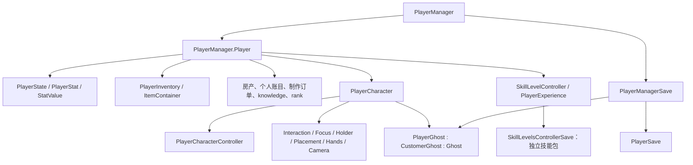

# REFERENCE — 修改器入口、公共运行库与 Player 结构档案

更新：2026-09-30。用途：修改器本体开发时查询模块职责、公共 API、业务入口、数据归属和验证边界。本文保留完整 Player 结构与原候选附录；四插件完整清单见 [HOOKS-REFERENCE.md](D:/NivalisNightsTrainer/outputs/HOOKS-REFERENCE.md)。

## 0. 当前总架构与开发标准

| 组件 | 职责 | 静态候选数 |
|---|---|---:|
| PlayerHook | 玩家业务、属性/技能、金钱、移动、交互与背包玩家入口 | 323 |
| WorldHook | 场景/旅行、Ghost、空间索引、任务对象、地产经营 | 349 |
| ItemHook | 库存、堆栈、逐件数据、腐坏、拾取摆放与家具 | 220 |
| GameRuntimeHook | 时间、模拟、天气/光照、存档、对象池 | 174 |
| HookRuntime | 四插件公共安装/卸载、校验、回调、采样、快照与状态管理 | 不另设业务清单 |

合计 1,066 个 v1.1 不重复候选签名/原生 RVA，数字不是游戏内成功安装或命中数。四个插件均继承 `NightsHack.HookRuntime.ObservationPlugin`；公共运行库是它们的依赖，不是额外的游戏功能插件。

统一构建：[Build-Hooks.ps1](D:/NivalisNightsTrainer/Build-Hooks.ps1)。统一交付：[outputs/Hooks](D:/NivalisNightsTrainer/outputs/Hooks)，包括四个插件 DLL 和一份 NightsHack.HookRuntime.dll。旧构建入口转发到统一构建，旧输出目录只是兼容副本，勿同时加载重复插件。DLL 身份以同目录 build-sha256.json 为准。

**项目标准：做多功能修改器，不做 ModLoader，不追求引擎内部或整个 Runtime 的穷尽覆盖。** 当前阶段需要的是正常游戏系统使用的真实业务入口；调用入口时，其内部辅助逻辑会自行执行，不要求逐层都装钩。静态入口已具备开发本体的基础，具体调用约束在各功能实现时验证。

### 可规划的首批功能

| 功能 | 已确认存在并纳入的入口示例 |
|---|---|
| 改钱 | PlayerInventory.set_Money |
| 属性、技能经验 | PlayerState.SetStat、SkillLevelController.AddExperience |
| 速度、位置传送 | SetPlayerSpeed、TeleportPlayer |
| 背包增减物品 | PlayerInventory.AddItem、ItemContainer.TryCreateInInventory/TryAdd/TryTake |
| 地点解锁、旅行 | UnlockLocation、RequestTravel |
| 经营库存容量、店铺等级/债务 | VenueInventory 容量 setter、Venue.DEV_SetLevel/set_CurrentDebt |
| 农业加速 | GreenhouseManager.SpeedUpFarming |
| 时间、暂停、天气 | AddTime、Pause、OverrideWeatherForecast |

以上是入口基础，不是已经完成的修改功能。具体属性/物品定义仍需绑定；无限物品、不腐坏和属性锁定需要持续策略。无敌、穿墙、飞行、任务一键完成未列为已验证能力。

### 公共 API 与 Player 迁移

四者均通过 `具体Hook.Active` 获取实例，再读 `Observations.TryDequeue/GetLatest`、`GetStatus()`、`FieldDiagnostics`、`Installed`。公共数据类型统一为 `NightsHack.HookRuntime.HookObservation / HookObservationBuffer / HookStatus`；旧 PlayerObservation 等显式类型已移除，相关消费者需重新编译。队列、CallId、采样器及状态仍按插件独立，不是全局统一事务编号。

Player 的 324 方法清单保持逐字节不变，32 个字段 schema、属性/技能最多 32 项枚举、knowledge 标志、PlayerStat 参数与锁对象快照保留。读取实现迁入公共库的 `NativeSnapshots.Player.cs`，由 PlayerHook 单独启用。新 DLL 需要公共运行库，旧单文件部署方式不再完整。

### 加物品预留接口与当前边界

`NightsHack.ItemHook.ItemHook.BackpackItems` 提供 `IBackpackItemAddition.AddToBackpackAsync(AddBackpackItemRequest, CancellationToken)`。请求携带 RequestId、ItemTypeGuid、Quantity，目标契约是执行时的本地玩家背包；不得把观察到的临时地址当作目标句柄。

当前 `IsImplemented=false`；有效请求返回 `NotImplemented`、`AddedQuantity=0`，无排队/物品创建。非法参数和预先取消有明确结果。后续本体需实现实际物品/玩家解析、游戏线程执行、失败/部分成功、实际数量回传及 IPC。不要把游戏 `Failed=0 / Partial=1 / Succeeded=2` 的入库结果当作 bool。

上一轮已完成四插件 Release 构建（0 警告/错误）和 36 项托管/静态检查。本次文档更新只核对清单和交付哈希，不新增运行验证。尚未部署、没有命令执行层或修改器本体；游戏内接受调用、UI/使用行为和存档一致性仍待逐功能验证。

## 1. 证据与版本

目标为 Unity 2020.3.44f1、Windows x64、IL2CPP。`Assembly-CSharp.dll` 是逻辑程序集名称，实际机器码在 `GameAssembly.dll`；DummyDll 只提供元数据，运行时使用 BepInEx 生成的 interop。

| 输入 | SHA256 |
|---|---|
| GameAssembly.dll | `9A0E32C2D09A5025F867D29BF39B9BEDD0715B513456617FBFD82C581E1A376D` |
| global-metadata.dat | `C8BD44F74B47136AEAD259DC2B88F289C12CB01E083FEEECDCD096A6FC1B2CF9` |

证据分级：

- **静态已验证**：元数据与所查机器码支持。完整原始证据和边界见 [Player 底层调查](D:/NivalisNightsTrainer/outputs/player-investigation.md)。该调查核对 75 份方法记录、74 个唯一 RVA，不代表所有方法实现均已恢复。
- **元数据已确认**：存在对应字段、签名或类型关系；方法名表达的用途不等于所有内部条件都已验证。
- **托管验证**：四个插件 Release 编译、15 项 Player 检查及 21 项跨插件/运行库检查通过；不能外推为原生 Hook 已运行。
- **未验证/未知**：运行时资产、当前实例、完整异常分支、性能及游戏内表现；下文分别指出。

`REFERENCE` 是开发存档，不是游戏更新后的自动适配保证。原始证据目录为 `work/player-investigation/`；全量元数据为 `work/il2cpp-validation-v1.1/dump.cs`。运行时禁止复用旧进程的地址。

## 2. 对象层次与权威数据



技能存档类的精确名称为 `Nivalis.SkillSystem.SkillLevelController+SkillLevelsControllerSave`。`+` 表示 CLR 嵌套类型，对应文档中的 `.`。

`PlayerManager.Player` 为业务对象，接口为 `IShopUser / ISkillUser / IPropertyOwner`。它不是 MonoBehaviour。`PlayerCharacter → BaseCharacter → MonoBehaviour` 才代表场景角色；Ghost 承担逻辑表示与专用保存。

| 对象 | 核心字段 | 含义/后续控制应找的位置 |
|---|---|---|
| PlayerManager | `_localPlayer` | 本地 Player；所查 `GetPlayer(int)` 仅 ID 0 返回它 |
| Player | `<Id>k__BackingField`、`_state`、`_character` | ID、属性状态、场景角色引用 |
| Player | `inventory`、`personalReceipts` | 余额/物品与个人账目 |
| Player | `_ownedProperties`、`<CurrentProperty>k__BackingField` | 房产标识集合与当前所处房产，不能混同所有权 |
| Player | `OrderMadeByPlayer`、`rank`、`knowledge` | 制作订单、经营评分、九项知识标志 |
| PlayerCharacter | `_controller/_interaction/_focus/_objectHolder/_placementSystem` | 场景子系统；部分业务 getter 会懒初始化，观察器不调用 |
| PlayerCharacter | `_myGhost`、`drivenBoat` | Ghost 同步与驾驶上下文 |
| PlayerInventory | `_money`、`_items`、`InventoryData` | 权威余额、物品容器及库存描述；余额显示 UI 非权威源 |
| SkillLevelController | `_playerData` | 独立技能记录，不存于 Player.rank |
| Ghost 基类 | `_transform`、`_sceneIndex`、`_id/_prefabId`、`_ghostView` | 逻辑位姿、场景、身份及场景视图 |

本版历史字段偏移及指令对应见底层调查；PlayerHook 按名字解析字段，**不依赖固定对象偏移**。这里的引用关系不能被当成可以离线持有/写入的永久对象句柄。

## 3. 核心逻辑与功能

### 3.1 生命周期与两种时间循环

**静态已验证**：`PlayerManager.Update → LocalPlayer._state.Update`。Player.Initialize 建立 PlayerState；角色另有创建、初始化、对象池销毁、Ghost 填充与重新贴合入口。

`PlayerCharacter.Update` 的已查主链为：Controller.ManualUpdate → Cinemachine → 相机缩放/焦点 → HandsAnimator → ObjectHolder → onHoldableUpdate → PlacementSystem → PlayerInteraction → IK → Transform 同步到 Ghost。实际受初始化状态及各分支约束。

属性使用游戏内秒 `TimeOfDayManager.TotalGameSeconds`。移动使用被限制到 0.1 秒的 `unscaledDeltaTime`，且检查暂停与移动锁。修改器不能用同一个“时间倍率”假设解释全部系统。

### 3.2 PlayerState 属性

结构：`Dictionary<PlayerStat, StatValue>`；配置 PlayerStat 包含 `name/valueRange/changeOverGameSecond/startValue`；StatValue 包含 `Nullable<int> LastUpdateTime` 与 `float Value`。

**静态已验证**：

1. 初始化值取 startValue，LastUpdateTime 初始为空。
2. Update 中首轮建立时间基准；正游戏秒差时计算 `Clamp(Value + elapsed × rate, min, max)`。
3. 该正时间差路径即使结果未变，也会发 `OnStatChanged`；最后更新时间基准。
4. `SetStat(stat,value)` 写既有字典条目并通知；本方法不 Clamp、不重置 LastUpdateTime。
5. 自动变化直接写 Value，不经过 SetStat，所以 PlayerHook 同时观察 Update、SetStat 与 GetStatValue。

**未知**：实际 PlayerStat 资产名称、范围、速率。不把通用字典预先命名为“血量/体力/饥饿”，也不能仅凭核心类没有 Health 字段断言没有伤害系统。未来锁值/冻结设计必须区分自动增减、显式设值、事件和时间基准。

### 3.3 移动、碰撞、NoClip、传送

**静态已验证**主链：`ManualUpdate → UpdateMovement → Move`。Normal 最终进入 Unity `CharacterController.Move_Injected`；NoClip 直接改 Transform.position。

```text
基础速度 = (_isSprinting ? sprintSpeed : defaultMoveSpeed) × _moveSpeedScale
NoClip 分支额外 × 3
SetPlayerSpeed(x) 写入 _moveSpeedScale = x / defaultMoveSpeed
get_MaxSpeed 仅返回 sprintSpeed
```

构造器中步行 3、冲刺 6 为代码初始值，资产可覆盖，不是实测当前速度。SetPlayerSpeed 未见零分母保护。重力、groundSnapping、isGrounded、_velocity、自定义 PlayerNavMesh、障碍检查共同影响最终位移。

状态枚举 `Normal=0 / NoClip=1`。ToggleNoClip 走 State setter；setter 影响 Collider，关闭时清除 PlayerNavMesh。NoClip 另有静态识别为 E/Q 的上下输入，但开发入口是否有可用热键未在游戏中测试。

TeleportPlayer 有 `(Vector3,Quaternion,bool)` 和 `(Transform,bool)` 重载，涉及 Collider、位置/旋转、可选贴地、POV 轴和速度清理；不是简单写一个坐标。NoClip 下调用后是否维持原碰撞状态、船只/NavMesh/保存落点是否一致，均未验证。

### 3.4 控制锁

`_canMove/_canSprint/_cameraLookEnabled/_interactionActive` 为 OverrideableBool。静态逻辑为：owners 非空时返回默认值的反值，否则返回默认值；不是每加一个 owner 就再翻转一次。

DisableMovement、DisableSprint、LockCamera、DisableInteractions 返回 OverrideLock。释放应针对申请者自己的锁；未来修改器不能通过清空全部 owners 来“恢复控制”，会破坏对话、持物、坐下等系统的锁。

PlayerObjectHolder 的锁涉及冲刺。Hold 冲刺分支显式检查冲刺锁，已查 Toggle 分支未见同样判断；此静态差异未游戏内复现。PlayerHook 不全局拦截通用 OverrideableBool.Release，只采样玩家对象所持锁的状态/引用及有关方法。

### 3.5 焦点、交互、持物、摆放

**静态已验证**：PlayerInteraction.OnInteraction 检查交互有效、目标、光标模式、未持物等条件，分派 `IInteractable.DoInteraction()`，再通知 OnInteract。不同目标自己的接口实现负责实际动作。

**元数据已确认**：

- FocusRaycaster：射线距离、半径、图层、排除对象、焦点/可交互/可持物列表和查找方法。
- PlayerObjectHolder：HoldObject、ReleaseObject、StoreEntity、RotateHeldObject、位置跟随、拾取与自己的锁。
- PlacementSystem：ManualUpdate、UpdateHeldObjectPlacementPosition、DoPlacement(bool,Vector3)、PlayerCaught、OnCurfewStart、OnPickUp/OnStore、ReleasePlayerLocks；字段含 maxPlacementDistance、throwForce、sphereRadius、RaycastHit、图层与音效。

摆放物理条件、物品转移事务和异常回滚尚未完整还原。钩住玩家交互入口不等于钩住每一种世界对象的内部动作。

### 3.6 动画、相机、环境与导航

PlayerHandsAnimator：手部 IK、root motion、可见性、吃饭、睡眠/醒来、坐姿、持餐、钓鱼、加工、种植、收获、清扫、报纸以及配套相机/移动/交互锁。多数详细动作目前只确认元数据和调用关系。

PlayerCameraController：缩放、焦点、对话目标、景深、相机复位；PlayerCharacterController 另有视角偏移、head bob、FOV 等入口。PlayerEnvironmentTracker：室内比例、最近 Venue 与距离、屋顶/房产/环境体积。PlayerNavMesh：网格贴合、障碍物、触发器；完整几何求解未恢复。

协程方法创建迭代器和后续 MoveNext 执行是两回事；本插件记录协程入口/返回引用，不声称捕捉完整动画结束时刻。Unity 引擎内部碰撞与 IK 算法未反编译。

### 3.7 余额、物品与交易

权威金额字段为 PlayerInventory._money，`set_Money(int)` 为当前版本确认的写入入口；PlayerHook 已纳入它的参数与前后字段快照。独立 MoneyHook 的核心观察功能已由 PlayerHook 承接，已按用户要求删除其源码、测试、构建脚本和交付物，保留金钱调查报告与静态证据。

未来修改器可以统一通过 PlayerHook 扩展的命令层调用玩家库存原 setter，不需要独立 MoneyHook。目前仍需实现有效实例解析、游戏线程执行与控制通信，并验证实际效果；不能直接把历史快照地址当作可写句柄。旧值/请求值/实际值对应同一 CallId 的 Before `_money`、Before `arg.value`、After `_money`，现有 setter 入口不做时间采样。统一队列/API 与旧专用记录结构不同。

Player 业务方法提供 TryMakePurchase、三个 TryMakeSale 重载、PayRent、日/总收支、所有权和库存枚举。购买指令中已见余额检查、物品转移分支、负金额 ShopTransactionReceipt、set_Money 与 Barter 经验；全部失败回滚未验证。

PlayerInventory 另有 TakeMoney、AddItem、AddAllFurniture、ClearItems 等入口；本插件只观察它们自然发生，不主动调用这些开发方法。底层通用 ItemContainer 的任意变更并未全局 Hook；_items/InventoryData 是引用快照，不是完整背包转储。直接字段写、内联调用和未拦截通路仍可能漏掉。

`ChangeMoneyWithoutReceipt/ReceiveMoney` 为共享 RVA，直接拦截有歧义，已排除；泛型 ChangeMoneyWithReceipt 也排除。将来改余额需要有意识地区分收据、事件锁、商店转移和存档，不能把“余额变化”当成“合法交易完成”。

### 3.8 技能经验

Player.AddExperience 将自身 ID 交给 SkillLevelController。权威记录为 `_playerData.PerSkillExperience : Dictionary<Type, PlayerSkillExperience>`，条目为 Experience(float) + CurrentLevel(int)。不是 rank。

**静态已验证**：AddExperience 读旧记录、加经验、调用技能定义求级别、写新记录、发通知；等级变化且有奖励信息时展示升级信息。已查管理器使用单个 _playerData，事件 playerId 为 0，不能仅凭参数推断多玩家数据表。

GetLevelForExperience 的泛型共享体逐级减 RelativeExperienceRequired，返回到达等级及余量；具体门槛来自资产，无已确认统一指数公式。ManagementLevel 与 ManagingLevel 两种符号不能擅自合并。

本插件观察非泛型 AddExperience 和管理器入口，并尝试最多 32 项的技能字典快照。泛型等级算法不直接补丁；技能 Type key 暂为对象引用标识，不宣称已映射成中文技能名。保存走独立 SkillLevelsControllerSave。

### 3.9 经营评分、所有权、制作订单、knowledge

**静态已验证**经营评分：

`rank = RoundToInt(100 × ΣVenue.tier + 300 × ΣAveragePopularity + 0.01 × ΣDayIncome)`

UpdateRank 还同步 Articy 的 `GameState.BossRanking`；DayIncome 不能随意改称净利润。OnCurfewStart 取消制作订单并更新评分。OnDayUpdate 有 ManagementLevel 经验奖励，完整奖励公式未确认。

制作订单为 `OrderMadeByPlayer → OrderData → 按 FoodItemType 分组的步骤`，步骤含 isDone、processingType、timeToProcess。MakePreparationStep 检查当前步骤类型后完成一步，发事件，订单完成时通知并清空。此方法本身未见 timeToProcess 耗时判断，不代表调用方无计时。

房产功能含新增/移除所有权、枚举 Venue/库存、进入场所/公寓/温室、当前房产清理、租金与收据。`CancelOrder/PrePlayerTravel` 共用原生地址，本插件不直接钩它们；其后果只能在其他入口快照中部分看到。

knowledge 九项 bool：fishing、trading、navigation、map、inspiration、storage、farming、renting、hiring。逐项保存已确认。**推断**与知识/功能解锁有关；各菜单、教程、剧情读者未逐一追完，改 bool 不保证完整解锁。

### 3.10 Ghost 顾客行为与输入

PlayerGhost 继承 CustomerGhost。涉及点单、选餐、座椅预留、坐下/起立、支付、venue、上次睡眠公寓和 LookRotation。SitDown 在 PlayerInputManager.PreventSaving 申请锁；起立释放座椅、清订单、释放保存锁。PayForOrder 已见 RestaurantReceipt 和余额 setter。它和 Player 的“制作订单”是两套状态。

PlayerInputManager 管动作映射、设备/控制方案、快捷键、重绑、暂停相关锁和绑定保存；本轮补充了方法观察与字段 schema。具体每项输入分派内部逻辑尚未逐一反汇编验证。静态辅助函数不钩。

## 4. 保存与恢复职责

```text
PlayerManager.WriteToPacket
  ├─ PlayerSave.GetSaveDataFromPlayer(LocalPlayer)
  └─ LocalPlayer.Character.MyGhost
PlayerManagerSave.Save
  ├─ Ghost.Save → 基础身份/场景/位姿 → PlayerGhost.SaveInternal(LookRotation)
  └─ PlayerSave.Save → Money / OwnedProperties / knowledge / personalReceipts / currentPropertyGuid
SkillLevelController.WriteToPacket → SkillLevelsControllerSave → 技能字典
PlayerInputManagerSave → BindingJsonString
```

PlayerGhost.IsPartOfSaveFile 返回 false，但专用 PlayerManagerSave 仍直接保存它；不能因此判断玩家不保存。

PlayerSave 未直接包含 PlayerState 字典与技能字典。初始化会新建 PlayerState，技能另走管理器包；并未证明其他系统绝不恢复属性值。坐下保存锁、场景与 Ghost 位姿同步都属于未来存档一致性边界。

**未验证**保存→退出→重载往返。GetSaveDataFromPlayer 为静态辅助入口，本插件观察其外围 WriteToPacket/Save/Load，而不直接钩它。

## 5. PlayerHook 实现与 API 契约

源码：[PlayerHook.cs](D:/NivalisNightsTrainer/src/NightsHack.PlayerHook/PlayerHook.cs)。使用说明：[README](D:/NivalisNightsTrainer/src/NightsHack.PlayerHook/README.md)。机器清单：[PlayerCatalog.json](D:/NivalisNightsTrainer/src/NightsHack.PlayerHook/PlayerCatalog.json)。

- 插件类 `NightsHack.PlayerHook.PlayerHook : ObservationPlugin`，ID `nightshack.playerhook`，产物 `PlayerHook.dll`，依赖四插件公共库 `NightsHack.HookRuntime.dll`。
- 基线为 BepInEx 6.0.0-pre.2 IL2CPP x64/net6.0。324 个候选入口、18 组；32 个 schema/338 字段；46 个明确排除条目。候选数量不是实际命中数量。
- SHA256 → 完整签名（含参数、ref/out、返回值）→ 动态 MethodInfo 原生入口与本版 RVA 对照 → Harmony 安装。拒绝不匹配项，不猜地址。
- 每个候选独立状态；`Installed` 只代表补丁 API 接受，`Observed` 代表回调计数大于 0；字段可仍存在不可用项。累计 3 次端点观察异常后为 ObservationDisabled。
- Prefix/Postfix 均为 void，无游戏字段写入、无原调用跳过、无参数/结果修改；不主动调用交易、设值、传送等玩法方法。
- Before/After 快照有 CallId，值已脱离游戏对象。队列上限 512 条，丢最旧有计数；Latest 按“方法+阶段”而非实例保存历史。默认对清单 Sampled=true 的入口每 250 ms 至多采一次（按方法跨实例）；计数仍计每次有效回调。
- 字段通过 IL2CPP API 解析/读取并校验类别、类型、原生大小；大于 256 字节值类型拒绝。字符串截至 160 字符，其他引用仅为诊断地址；未通用遍历整个对象图。
- PlayerKnowledge 九个 bool 和 Vector2/3/Quaternion 有可读值；未解码结构如 Nullable<int>、Ghost._transform 等保留带类型的原生字节，不假称已得到通用坐标/时间对象。
- 属性、技能尝试通过已验证原生字段对应的生成字段属性和只读 BCL 枚举器读取，每字典最多 32 条。失败写 unavailable；不能把失败理解为字典为空。字典结构在首次实机加载时仍需验证。
- 快照可以包含 BaseCharacter/Ghost/CustomerGhost 基类字段、玩家当前持有的 OverrideableBool/OverrideLock；不遍历所有 owners，不通过 get_Value 推断当前锁的最终布尔值。
- 方法异常时可能只有 Before，队列丢弃/卸载/观察失败也可能造成阶段缺失；没有 finalizer 修改游戏异常。协程入口不是完成事件。
- 不筛选本地玩家；不能把任意 PlayerInventory 的快照自动认作 LocalPlayer。方法内重入、其他补丁、内联、直接写字段都会影响完整性。

未来游戏内控制组件的读取入口：`PlayerHook.Active.Observations.TryDequeue/GetLatest`、`GetStatus()`、`FieldDiagnostics`。进程外 UI 还需单独设计 IPC，本轮没有实现。数据队列中不保留 Unity 对象强引用或可调用句柄；历史地址不可直接当下一次写操作的对象。

## 6. 开发修改器本体时的接入边界

| 需求 | 应优先复用的业务入口/数据 | 必须处理的语义 |
|---|---|---|
| 改余额 | PlayerInventory.Money / 明确的收据路径 | 通知、锁、交易与账目是否同步 |
| 改属性/冻结 | PlayerState 字典、SetStat、Update | 范围、事件、时间基准、自动更新旁路 |
| 速度 | Controller.SetPlayerSpeed | 冲刺、船、碰撞、NavMesh 与输入；飞行不属于已确认功能 |
| 传送 | 正确 TeleportPlayer 重载 | 地面、相机、Collider、Ghost、场景、保存 |
| 技能 | SkillLevelController.AddExperience | 等级重算、门槛资产、通知/奖励和独立存档 |
| 经营评分 | Player.UpdateRank | Venue 输入与 Articy 同步，不能只写 rank |
| 房产/库存 | Player 所有权与交易方法 | 引用、容器容量/类型、收据、转移与失败回滚 |
| 制作订单 | MakePreparationStep/TakeOrder | 当前步骤、计时调用方、完成事件与清理 |
| 解锁 | knowledge 与实际读取方 | bool 保存并不保证所有剧情/教程完成 |
| 控制解锁 | 自己申请的 OverrideLock | 不释放其他系统持有的锁 |
| 保存 | PlayerManager/技能/输入各包 | 坐下锁、位姿同步、多包恢复一致性 |

上述是设计依据，**不是已实现的写功能或已验证可随意调用的 API**。后续按具体功能实现由游戏线程执行的受控命令，并验证加载、签名、实例归属、命中与实际结果；无需先扩大整个 Runtime 的覆盖。不要从 UI 工作线程直接操作 Unity 对象。

## 7. 当前验证与剩余未知

- 四个插件 Release 构建、15 项 Player 检查及 21 项跨插件/运行库检查通过。检查签名/重载拒绝、hash 变化、共享地址排除、覆盖组、队列/不可变快照/并发、采样、编译后 Prefix/Postfix 形状和禁用写 API 引用。
- 在线 NuGet 漏洞数据查询失败；用缓存引用和单次 `NuGetAudit=false` 参数还原。没有升级依赖，没有声称完成在线漏洞审计。
- **未部署、未附加、未在游戏内验证。** 候选的实际可安装数量、字典投影兼容、字段快照、自然调用命中、开销、卸载和保存往返均仍未知。
- 后附表直接从静态 Catalog 导出，状态是“候选/排除”，不应被改写成“全部已成功 Hook”。生成器只生成文档附录，不自动宣称函数内部行为。

<!-- PLAYERHOOK_CATALOG_APPENDIX -->

## 附录 A：候选方法清单（静态目录，不是实机命中清单）

以下完整签名来自本地 DummyDll；RVA 经 script.json 共享地址筛选。采样“是”表示按配置间隔限频，包括部分低频 Update 命名入口。

### Animation（76 个候选）

| 完整类型与方法参数 | 返回类型 | 本版 RVA | 采样 |
|---|---|---|---|
| `Nivalis.PlayerHandsAnimator.set_RootMotion(System.Boolean value)` | `System.Void` | `0x2EF8B20` | 否 |
| `Nivalis.PlayerHandsAnimator.Awake()` | `System.Void` | `0x2EF8C00` | 否 |
| `Nivalis.PlayerHandsAnimator.Start()` | `System.Void` | `0x2EF8DD0` | 否 |
| `Nivalis.PlayerHandsAnimator.ManualUpdate()` | `System.Void` | `0x2EF9210` | 是 |
| `Nivalis.PlayerHandsAnimator.OnDestroy()` | `System.Void` | `0x2EF9400` | 否 |
| `Nivalis.PlayerHandsAnimator.Init()` | `System.Void` | `0x2EF99C0` | 否 |
| `Nivalis.PlayerHandsAnimator.AnimatorStartInteract(UnityEngine.AnimationEvent animationEvent)` | `System.Void` | `0x2EF9A30` | 否 |
| `Nivalis.PlayerHandsAnimator.AnimatorStopInteract(UnityEngine.AnimationEvent animationEvent)` | `System.Void` | `0x2EF9EF0` | 否 |
| `Nivalis.PlayerHandsAnimator.Hide(System.Object debugOwner)` | `Nivalis.OverrideableBool+OverrideLock` | `0x2EFA0D0` | 否 |
| `Nivalis.PlayerHandsAnimator.Eat(Nivalis.GhostSystem.CustomerLoop.MealView mealView, System.Action onFinish)` | `System.Void` | `0x2EFA110` | 否 |
| `Nivalis.PlayerHandsAnimator.SetRigParent(UnityEngine.Transform parent)` | `System.Void` | `0x2EFA1C0` | 否 |
| `Nivalis.PlayerHandsAnimator.UpdateIK()` | `System.Void` | `0x2EFAE80` | 是 |
| `Nivalis.PlayerHandsAnimator.LimitFreelook()` | `System.Void` | `0x2EFAEC0` | 否 |
| `Nivalis.PlayerHandsAnimator.EatingSequence(Nivalis.GhostSystem.CustomerLoop.MealView mealView, System.Action onFinish)` | `System.Collections.IEnumerator` | `0x2EFB0F0` | 否 |
| `Nivalis.PlayerHandsAnimator.UpdateFreelookCamera()` | `System.Void` | `0x2EFB1A0` | 是 |
| `Nivalis.PlayerHandsAnimator.UpdateRig()` | `System.Void` | `0x2EFB8B0` | 是 |
| `Nivalis.PlayerHandsAnimator.UpdateRootMotion()` | `System.Void` | `0x2EFC410` | 是 |
| `Nivalis.PlayerHandsAnimator.ResetRootMotion()` | `System.Void` | `0x2EFC8C0` | 否 |
| `Nivalis.PlayerHandsAnimator.SetCameraTargetOverride(System.Boolean isSet, Nivalis.PlayerHandsAnimator+EulerPose cameraTargetOverride, UnityEngine.Pose snapLocationPose)` | `System.Void` | `0x2EFCAB0` | 否 |
| `Nivalis.PlayerHandsAnimator.UpdateCamera()` | `System.Void` | `0x2EFCDD0` | 是 |
| `Nivalis.PlayerHandsAnimator.LockPlayer()` | `System.Void` | `0x2EFDE20` | 否 |
| `Nivalis.PlayerHandsAnimator.UnlockPlayer()` | `System.Void` | `0x2EFDF80` | 否 |
| `Nivalis.PlayerHandsAnimator.LockCamera()` | `System.Void` | `0x2EFE0A0` | 否 |
| `Nivalis.PlayerHandsAnimator.UnlockCamera()` | `System.Void` | `0x2EFE260` | 否 |
| `Nivalis.PlayerHandsAnimator.UpdateSpeed()` | `System.Void` | `0x2EFE4C0` | 是 |
| `Nivalis.PlayerHandsAnimator.UpdatePlacement()` | `System.Void` | `0x2EFE750` | 是 |
| `Nivalis.PlayerHandsAnimator.UpdateTray()` | `System.Void` | `0x2EFE950` | 是 |
| `Nivalis.PlayerHandsAnimator.UpdateSitting()` | `System.Void` | `0x2EFED60` | 是 |
| `Nivalis.PlayerHandsAnimator.SitDownSequence()` | `System.Collections.IEnumerator` | `0x2EFF0A0` | 否 |
| `Nivalis.PlayerHandsAnimator.StandUpSequence()` | `System.Collections.IEnumerator` | `0x2EFF100` | 否 |
| `Nivalis.PlayerHandsAnimator.OnItemPlaced(Nivalis.ItemPlacedArguments args)` | `System.Void` | `0x2EFF160` | 否 |
| `Nivalis.PlayerHandsAnimator.PlaySweepAnimation(UnityEngine.Pose pose, System.Action onCleanup)` | `System.Void` | `0x2EFF260` | 否 |
| `Nivalis.PlayerHandsAnimator.SweepSequence(UnityEngine.Pose pose, System.Action onCleanup)` | `System.Collections.IEnumerator` | `0x2EFF310` | 否 |
| `Nivalis.PlayerHandsAnimator.PlayIngredientProcessorAnimation(Nivalis.AISpot spot, Nivalis.CraftingSystem.IngredientProcessingType type, System.Action onComplete)` | `System.Void` | `0x2EFF3B0` | 否 |
| `Nivalis.PlayerHandsAnimator.PlayFoodProcessorAnimation(Nivalis.AISpot spot, System.Boolean isDrinkMachine, System.Action onComplete)` | `System.Void` | `0x2EFF7D0` | 否 |
| `Nivalis.PlayerHandsAnimator.CookingSequence(Nivalis.AISpot spot, System.String animation, System.Single duration, UnityEngine.Vector3 rigOffset, System.Action onComplete)` | `System.Collections.IEnumerator` | `0x2EFF8A0` | 否 |
| `Nivalis.PlayerHandsAnimator.PlayPlantAnimation(UnityEngine.Pose location, Nivalis.PlayerHandsAnimator+FarmingAnimationPose pose, System.Action onPlant)` | `System.Void` | `0x2EFF990` | 否 |
| `Nivalis.PlayerHandsAnimator.PlantSequence(Nivalis.PlayerHandsAnimator+FarmingAnimationPose pose, System.Action onPlant)` | `System.Collections.IEnumerator` | `0x2EFFDA0` | 否 |
| `Nivalis.PlayerHandsAnimator.PlayHarvestAnimation(UnityEngine.Pose location, Nivalis.PlayerHandsAnimator+FarmingAnimationPose pose, System.Action onHarvest, Nivalis.InventorySystem.ItemType plantType)` | `System.Void` | `0x2EFFE30` | 否 |
| `Nivalis.PlayerHandsAnimator.HarvestSequence(UnityEngine.Pose location, Nivalis.PlayerHandsAnimator+FarmingAnimationPose pose, System.Action onHarvest, Nivalis.InventorySystem.ItemType plantType)` | `System.Collections.IEnumerator` | `0x2F00270` | 否 |
| `Nivalis.PlayerHandsAnimator.PlantPullSequence(Nivalis.InventorySystem.ItemType plantType, UnityEngine.Pose location)` | `System.Collections.IEnumerator` | `0x2F00320` | 否 |
| `Nivalis.PlayerHandsAnimator.OnVisibleValueChanged()` | `System.Void` | `0x2F003C0` | 否 |
| `Nivalis.PlayerHandsAnimator.PlaySleepAnimation(Nivalis.IBed bed, System.Boolean instant)` | `System.Void` | `0x2F004C0` | 否 |
| `Nivalis.PlayerHandsAnimator.PlayAwakeAnimation()` | `System.Void` | `0x2F00560` | 否 |
| `Nivalis.PlayerHandsAnimator.SleepSequence(Nivalis.IBed bed, System.Boolean instant)` | `System.Collections.IEnumerator` | `0x2F005A0` | 否 |
| `Nivalis.PlayerHandsAnimator.SetFishing(System.Boolean fishing)` | `System.Void` | `0x2F00630` | 否 |
| `Nivalis.PlayerHandsAnimator.PlayFishingRodBigSwing()` | `System.Void` | `0x2F007D0` | 否 |
| `Nivalis.PlayerHandsAnimator.FishingRodBigSwingSequence()` | `System.Collections.IEnumerator` | `0x2F00840` | 否 |
| `Nivalis.PlayerHandsAnimator.SetFishCatch(System.Boolean fishCatch)` | `System.Void` | `0x2F008A0` | 否 |
| `Nivalis.PlayerHandsAnimator.SetLeftHandIK(UnityEngine.Transform target, System.Single positionWeight, System.Single rotationWeight)` | `System.Void` | `0x2F00960` | 否 |
| `Nivalis.PlayerHandsAnimator.ClearLeftHandIK()` | `System.Void` | `0x2F009D0` | 否 |
| `Nivalis.PlayerHandsAnimator.SetRightHandIK(UnityEngine.Transform target, System.Single positionWeight, System.Single rotationWeight)` | `System.Void` | `0x2F00A40` | 否 |
| `Nivalis.PlayerHandsAnimator.ClearRightHandIK()` | `System.Void` | `0x2F00AB0` | 否 |
| `Nivalis.PlayerHandsAnimator.OnInteract(Nivalis.IInteractable interactable)` | `System.Void` | `0x2F00B20` | 否 |
| `Nivalis.PlayerHandsAnimator.PlayMealConsumeSFX(System.Boolean isDrink, System.Boolean isShort)` | `System.Void` | `0x2F00CA0` | 否 |
| `Nivalis.PlayerHandsAnimator.PlayInteraction(Nivalis.InteractionAnimation animation)` | `System.Void` | `0x2F00CF0` | 否 |
| `Nivalis.PlayerHandsAnimator.StartHoldingMeal(Nivalis.GhostSystem.CustomerLoop.MealView meal)` | `System.Void` | `0x2F00DC0` | 否 |
| `Nivalis.PlayerHandsAnimator.StartHoldingMealSequence(Nivalis.GhostSystem.CustomerLoop.MealView meal)` | `System.Collections.IEnumerator` | `0x2F00E90` | 否 |
| `Nivalis.PlayerHandsAnimator.StopHoldingMeal(Nivalis.GhostSystem.CustomerLoop.MealView meal, System.Action onFinish)` | `System.Void` | `0x2F00F10` | 否 |
| `Nivalis.PlayerHandsAnimator.StopHoldingMealSequence(Nivalis.GhostSystem.CustomerLoop.MealView meal, System.Action onFinish)` | `System.Collections.IEnumerator` | `0x2F00FE0` | 否 |
| `Nivalis.PlayerHandsAnimator.ToggleNewspaper()` | `System.Void` | `0x2F01090` | 否 |
| `Nivalis.PlayerHandsAnimator.TryToEquipNewspaper(System.Boolean newspaperOpenedFromMenu)` | `System.Void` | `0x2F01230` | 否 |
| `Nivalis.PlayerHandsAnimator.EquipNewspaper()` | `UnityEngine.Coroutine` | `0x2F013C0` | 否 |
| `Nivalis.PlayerHandsAnimator.TryUnequipNewspaper()` | `System.Void` | `0x2F01450` | 否 |
| `Nivalis.PlayerHandsAnimator.NewspaperSequence()` | `System.Collections.IEnumerator` | `0x2F015C0` | 否 |
| `Nivalis.PlayerHandsAnimator.StartCameraTilt(System.Single angle, System.Single duration)` | `System.Void` | `0x2F01620` | 否 |
| `Nivalis.PlayerHandsAnimator.CameraTiltSequence(System.Single angle, System.Single duration)` | `System.Collections.IEnumerator` | `0x2F016B0` | 否 |
| `Nivalis.PlayerHandsAnimator.SetDutchAngle(System.Single angle)` | `System.Void` | `0x2F01730` | 否 |
| `Nivalis.PlayerHandsAnimator.UpdateFootsteps()` | `System.Void` | `0x2F017C0` | 是 |
| `Nivalis.PlayerHandsAnimator.GetSurface()` | `System.String` | `0x2F01CF0` | 否 |
| `Nivalis.PlayerHandsAnimator.IsInPuddle(UnityEngine.RaycastHit hit)` | `System.Boolean` | `0x2F02290` | 否 |
| `Nivalis.PlayerHandsAnimator.IsInSnow(UnityEngine.RaycastHit hit)` | `System.Boolean` | `0x2F02410` | 否 |
| `Nivalis.PlayerHandsAnimator.ReleaseTrayMeals()` | `System.Void` | `0x2F02540` | 否 |
| `Nivalis.PlayerHandsAnimator.<SleepSequence>b__144_0()` | `System.Boolean` | `0x2F02AB0` | 否 |
| `Nivalis.PlayerHandsAnimator.<NewspaperSequence>b__164_0()` | `System.Boolean` | `0x2F02AC0` | 否 |
| `Nivalis.PlayerHandsAnimator.<NewspaperSequence>b__164_1()` | `System.Boolean` | `0x2F02AE0` | 否 |

### Camera（15 个候选）

| 完整类型与方法参数 | 返回类型 | 本版 RVA | 采样 |
|---|---|---|---|
| `Nivalis.PlayerCameraController.Awake()` | `System.Void` | `0x9BC920` | 否 |
| `Nivalis.PlayerCameraController.OnEnable()` | `System.Void` | `0x9BCE50` | 否 |
| `Nivalis.PlayerCameraController.OnDisable()` | `System.Void` | `0x9BCED0` | 否 |
| `Nivalis.PlayerCameraController.CameraZoomCooldown()` | `System.Void` | `0x9BD090` | 否 |
| `Nivalis.PlayerCameraController.UpdateCameraZooming()` | `System.Void` | `0x9BD0A0` | 是 |
| `Nivalis.PlayerCameraController.ManualUpdate()` | `System.Void` | `0x9BD6D0` | 是 |
| `Nivalis.PlayerCameraController.OnDestroy()` | `System.Void` | `0x9BD810` | 否 |
| `Nivalis.PlayerCameraController.SetDepthOfField(System.Boolean enabled, System.Single focusDistance, System.Single aperture)` | `System.Void` | `0x9BDA60` | 否 |
| `Nivalis.PlayerCameraController.ResetFollowTarget()` | `System.Void` | `0x9BE060` | 否 |
| `Nivalis.PlayerCameraController.OnSceneLoad()` | `System.Void` | `0x9BE140` | 否 |
| `Nivalis.PlayerCameraController.UpdatePostProcesVolumes()` | `System.Void` | `0x9BE2A0` | 是 |
| `Nivalis.PlayerCameraController.OnDialogueStart(Nivalis.Dialogue.DialogueEventArgs args)` | `System.Void` | `0x9BE3C0` | 否 |
| `Nivalis.PlayerCameraController.OnDialogueEnd(Nivalis.Dialogue.DialogueEventArgs args)` | `System.Void` | `0x9BE640` | 否 |
| `Nivalis.PlayerCameraController.UpdateFocusTarget()` | `System.Void` | `0x9BE660` | 是 |
| `Nivalis.PlayerCameraController.SetFocusTarget(UnityEngine.Transform target, UnityEngine.Transform parent, System.Boolean dialogueDistance)` | `System.Void` | `0x9BE9A0` | 否 |

### Character（14 个候选）

| 完整类型与方法参数 | 返回类型 | 本版 RVA | 采样 |
|---|---|---|---|
| `Nivalis.PlayerCharacter.set_DrivenBoat(Nivalis.Boat.BoatController value)` | `System.Void` | `0x9BFAB0` | 否 |
| `Nivalis.PlayerCharacter.set_ViewId(System.String value)` | `System.Void` | `0x9C0250` | 否 |
| `Nivalis.PlayerCharacter.SceneLoadCompletedListener()` | `System.Void` | `0x9C0290` | 否 |
| `Nivalis.PlayerCharacter.Initialize()` | `System.Void` | `0x9C0370` | 否 |
| `Nivalis.PlayerCharacter.Update()` | `System.Void` | `0x9C0710` | 是 |
| `Nivalis.PlayerCharacter.ResetPlayerToPosition(Nivalis.PositionRotation myGhostTransform)` | `System.Collections.IEnumerator` | `0x9C0AC0` | 否 |
| `Nivalis.PlayerCharacter.OnDestroy()` | `System.Void` | `0x9C0C70` | 否 |
| `Nivalis.PlayerCharacter.OnPoolingPostDestroy()` | `System.Void` | `0x9C0D70` | 否 |
| `Nivalis.PlayerCharacter.CreateGhostFromView(Nivalis.GhostSystem.IGhostRegistry ghostRegistry)` | `Nivalis.GhostSystem.Ghost` | `0x9C0EB0` | 否 |
| `Nivalis.PlayerCharacter.CreateGhostBaseFromView()` | `Nivalis.GhostSystem.Ghost` | `0x9C0F00` | 否 |
| `Nivalis.PlayerCharacter.FillGhostBaseFromViewState(Nivalis.GhostSystem.Ghost ghost, Nivalis.GhostSystem.IGhostRegistry ghostRegistry)` | `System.Boolean` | `0x9C1070` | 否 |
| `Nivalis.PlayerCharacter.SnapToGhost()` | `System.Void` | `0x9C1300` | 是 |
| `Nivalis.PlayerCharacter.GetSpotId(Nivalis.AISpot spot)` | `System.Int32` | `0x9C1420` | 否 |
| `Nivalis.PlayerCharacter.GetSpot(System.Int32 spotId)` | `Nivalis.AISpot` | `0x9C1860` | 否 |

### Environment（6 个候选）

| 完整类型与方法参数 | 返回类型 | 本版 RVA | 采样 |
|---|---|---|---|
| `Nivalis.PlayerEnvironmentTracker.Update()` | `System.Void` | `0x2EF1CE0` | 是 |
| `Nivalis.PlayerEnvironmentTracker.IsInsideProperty()` | `System.Boolean` | `0x2EF1D00` | 否 |
| `Nivalis.PlayerEnvironmentTracker.IsUnderRoof()` | `System.Boolean` | `0x2EF1E60` | 否 |
| `Nivalis.PlayerEnvironmentTracker.ApplyVolumes(System.Single& interiorAmount)` | `System.Boolean` | `0x2EF2020` | 否 |
| `Nivalis.PlayerEnvironmentTracker.UpdateInterior()` | `System.Void` | `0x2EF2210` | 是 |
| `Nivalis.PlayerEnvironmentTracker.UpdateClosestVenue()` | `System.Void` | `0x2EF2630` | 是 |

### Focus（7 个候选）

| 完整类型与方法参数 | 返回类型 | 本版 RVA | 采样 |
|---|---|---|---|
| `Nivalis.FocusRaycaster.Awake()` | `System.Void` | `0x3031E40` | 否 |
| `Nivalis.FocusRaycaster.UpdateFocus()` | `System.Void` | `0x3031EB0` | 是 |
| `Nivalis.FocusRaycaster.ClearFocus()` | `System.Void` | `0x3032350` | 否 |
| `Nivalis.FocusRaycaster.CheckClearFocus(System.Boolean update)` | `System.Void` | `0x3032470` | 否 |
| `Nivalis.FocusRaycaster.FindInteractable()` | `Nivalis.IInteractable` | `0x3032500` | 是 |
| `Nivalis.FocusRaycaster.FindAgent()` | `Nivalis.GhostSystem.Ai.Agent` | `0x3032730` | 是 |
| `Nivalis.FocusRaycaster.FindHoldableEntity(System.Boolean updateFocus)` | `Nivalis.HoldableEntity` | `0x3032980` | 是 |

### Ghost（14 个候选）

| 完整类型与方法参数 | 返回类型 | 本版 RVA | 采样 |
|---|---|---|---|
| `Nivalis.PlayerGhost.SaveInternal(Nivalis.ISaveWriter writer)` | `System.Void` | `0x2EF7140` | 否 |
| `Nivalis.PlayerGhost.LoadInternal(Nivalis.SaveReader reader, System.String id, System.String prefabId)` | `System.Boolean` | `0x2EF7250` | 否 |
| `Nivalis.PlayerGhost.UpdateOrder()` | `System.Void` | `0x2EF72D0` | 是 |
| `Nivalis.PlayerGhost.ChooseMeal()` | `System.Void` | `0x2EF7340` | 否 |
| `Nivalis.PlayerGhost.SetOrder(Nivalis.GhostSystem.CustomerLoop.VenueOrderReference order)` | `System.Void` | `0x2EF74F0` | 否 |
| `Nivalis.PlayerGhost.ClearOrder()` | `System.Void` | `0x2EF7550` | 否 |
| `Nivalis.PlayerGhost.SitDown(Nivalis.GhostSystem.CustomerLoop.ChairGhost chair, Nivalis.GhostSystem.CustomerLoop.Venue venue)` | `System.Void` | `0x2EF7680` | 否 |
| `Nivalis.PlayerGhost.GetUpFromChair()` | `System.Void` | `0x2EF79E0` | 否 |
| `Nivalis.PlayerGhost.ReleaseSavingLock()` | `System.Void` | `0x2EF7BA0` | 否 |
| `Nivalis.PlayerGhost.PayForOrder()` | `System.Void` | `0x2EF7CD0` | 否 |
| `Nivalis.PlayerGhost.ReserveChair()` | `System.Void` | `0x2EF8090` | 否 |
| `Nivalis.PlayerGhost.FreeChair()` | `System.Void` | `0x2EF83C0` | 否 |
| `Nivalis.PlayerGhost.InterruptReservation(Nivalis.GhostSystem.IAgentReservable reservable)` | `System.Void` | `0x2EF8750` | 否 |
| `Nivalis.PlayerGhost.OnMealChosen(System.Collections.Generic.List`1<Nivalis.Locale.MealMenuItem> meals)` | `System.Void` | `0x2EF8960` | 否 |

### Holding（16 个候选）

| 完整类型与方法参数 | 返回类型 | 本版 RVA | 采样 |
|---|---|---|---|
| `Nivalis.PlayerObjectHolder.PositionInFrontOfPlayer(Nivalis.HoldableEntity targetEntity)` | `UnityEngine.Vector3` | `0x2DCA650` | 否 |
| `Nivalis.PlayerObjectHolder.Awake()` | `System.Void` | `0x2DCA8E0` | 否 |
| `Nivalis.PlayerObjectHolder.Start()` | `System.Void` | `0x2DCA9A0` | 否 |
| `Nivalis.PlayerObjectHolder.ManualUpdate()` | `System.Void` | `0x2DCAA90` | 是 |
| `Nivalis.PlayerObjectHolder.UpdateHeldObjectPosition()` | `System.Void` | `0x2DCADE0` | 是 |
| `Nivalis.PlayerObjectHolder.UpdateHeldObjectRotation()` | `System.Void` | `0x2DCB040` | 是 |
| `Nivalis.PlayerObjectHolder.TryPickupObjectInFront()` | `System.Void` | `0x2DCB300` | 否 |
| `Nivalis.PlayerObjectHolder.CheckForObjectInFront()` | `System.Void` | `0x2DCB600` | 否 |
| `Nivalis.PlayerObjectHolder.HoldObject(Nivalis.HoldableEntity entity)` | `System.Boolean` | `0x2DCBA80` | 否 |
| `Nivalis.PlayerObjectHolder.ReleaseObject()` | `System.Void` | `0x2DCBDA0` | 否 |
| `Nivalis.PlayerObjectHolder.StoreEntity(Nivalis.InventorySystem.IItemContainer overrideContainer)` | `System.Boolean` | `0x2DCC3F0` | 否 |
| `Nivalis.PlayerObjectHolder.SetHeldObj(Nivalis.HoldableEntity newHeldObj)` | `System.Void` | `0x2DCC6B0` | 否 |
| `Nivalis.PlayerObjectHolder.OnHeldObjDestroyed()` | `System.Void` | `0x2DCCA20` | 否 |
| `Nivalis.PlayerObjectHolder.RotateHeldObject(System.Single rotation, UnityEngine.Vector3 axis)` | `System.Void` | `0x2DCCAD0` | 否 |
| `Nivalis.PlayerObjectHolder.GrabPlayerLocks()` | `System.Void` | `0x2DCCBA0` | 否 |
| `Nivalis.PlayerObjectHolder.ReleasePlayerLocks()` | `System.Void` | `0x2DCCC40` | 否 |

### Input（36 个候选）

| 完整类型与方法参数 | 返回类型 | 本版 RVA | 采样 |
|---|---|---|---|
| `Nivalis.PlayerInputManager.InitializeInternal(Nivalis.ManagerConfiguration configuration, Nivalis.ISavePacket packet)` | `System.Void` | `0x2F05770` | 否 |
| `Nivalis.PlayerInputManager.InitializeExternal()` | `System.Void` | `0x2F05870` | 否 |
| `Nivalis.PlayerInputManager.CreatePacket()` | `Nivalis.ISavePacket` | `0x2F058E0` | 否 |
| `Nivalis.PlayerInputManager.WriteToPacket(Nivalis.ISavePacket packet)` | `System.Void` | `0x2F05960` | 否 |
| `Nivalis.PlayerInputManager.InitializeListeners()` | `System.Collections.IEnumerator` | `0x2F05A00` | 否 |
| `Nivalis.PlayerInputManager.HasSteamInputGamepad()` | `System.Boolean` | `0x2F05A60` | 否 |
| `Nivalis.PlayerInputManager.InputDeviceChanged(UnityEngine.InputSystem.InputDevice device, UnityEngine.InputSystem.InputDeviceChange change)` | `System.Void` | `0x2F05C50` | 否 |
| `Nivalis.PlayerInputManager.UnpairedDeviceUsed(UnityEngine.InputSystem.InputControl control, UnityEngine.InputSystem.LowLevel.InputEventPtr eventPtr)` | `System.Void` | `0x2F05DD0` | 否 |
| `Nivalis.PlayerInputManager.InputChanged(UnityEngine.InputSystem.Users.InputUser user, UnityEngine.InputSystem.Users.InputUserChange change, UnityEngine.InputSystem.InputDevice device)` | `System.Void` | `0x2F05FD0` | 否 |
| `Nivalis.PlayerInputManager.TabRightListener(UnityEngine.InputSystem.InputAction+CallbackContext obj)` | `System.Void` | `0x2F05FF0` | 否 |
| `Nivalis.PlayerInputManager.TabLeftListener(UnityEngine.InputSystem.InputAction+CallbackContext obj)` | `System.Void` | `0x2F06010` | 否 |
| `Nivalis.PlayerInputManager.OnDestroyInternal()` | `System.Void` | `0x2F06030` | 否 |
| `Nivalis.PlayerInputManager.JournalShortcutListener(UnityEngine.InputSystem.InputAction+CallbackContext obj)` | `System.Void` | `0x2F06C30` | 否 |
| `Nivalis.PlayerInputManager.ShowMoreShortcutListener(UnityEngine.InputSystem.InputAction+CallbackContext obj)` | `System.Void` | `0x2F06CF0` | 否 |
| `Nivalis.PlayerInputManager.ShoppingListShortcutListener(UnityEngine.InputSystem.InputAction+CallbackContext obj)` | `System.Void` | `0x2F06DB0` | 否 |
| `Nivalis.PlayerInputManager.InventoryShortcutListener(UnityEngine.InputSystem.InputAction+CallbackContext obj)` | `System.Void` | `0x2F06E70` | 否 |
| `Nivalis.PlayerInputManager.MapToggleListener(UnityEngine.InputSystem.InputAction+CallbackContext obj)` | `System.Void` | `0x2F06F30` | 否 |
| `Nivalis.PlayerInputManager.AnyKeyListener(UnityEngine.InputSystem.InputAction+CallbackContext obj)` | `System.Void` | `0x2F06FF0` | 否 |
| `Nivalis.PlayerInputManager.ScanListener(UnityEngine.InputSystem.InputAction+CallbackContext obj)` | `System.Void` | `0x2F07010` | 否 |
| `Nivalis.PlayerInputManager.GetBindingIndexForControlScheme(UnityEngine.InputSystem.InputAction action)` | `System.Int32` | `0x2F07030` | 否 |
| `Nivalis.PlayerInputManager.GetActionForActionReference(UnityEngine.InputSystem.InputActionReference actionReference)` | `UnityEngine.InputSystem.InputAction` | `0x2F07210` | 否 |
| `Nivalis.PlayerInputManager.SwitchControlScheme(UnityEngine.InputSystem.InputDevice currentDevice)` | `System.Void` | `0x2F072B0` | 否 |
| `Nivalis.PlayerInputManager.SwitchMenuActionMap(System.Boolean menu)` | `System.Void` | `0x2F078F0` | 否 |
| `Nivalis.PlayerInputManager.SwitchActionMap(UnityEngine.InputSystem.InputActionMap inputMap)` | `System.Void` | `0x2F07980` | 否 |
| `Nivalis.PlayerInputManager.SwitchDevice()` | `System.Void` | `0x2F079F0` | 否 |
| `Nivalis.PlayerInputManager.IsBindingComposite(UnityEngine.InputSystem.InputActionReference actionReference)` | `System.Boolean` | `0x2F07A70` | 否 |
| `Nivalis.PlayerInputManager.GetBindingDisplay(UnityEngine.InputSystem.InputActionReference actionReference, System.Int32 compositeIndex, System.Boolean useBlackAndWhiteVersion)` | `Nivalis.DeviceDisplayConfigurator+DisplayData` | `0x2F07C30` | 否 |
| `Nivalis.PlayerInputManager.StartRebind(UnityEngine.InputSystem.InputActionReference actionReference, System.Int32 compositeIndex)` | `System.Void` | `0x2F080F0` | 否 |
| `Nivalis.PlayerInputManager.ResetRebind(UnityEngine.InputSystem.InputActionReference actionReference, System.Int32 compositeIndex)` | `System.Void` | `0x2F08150` | 否 |
| `Nivalis.PlayerInputManager.DoRebind(UnityEngine.InputSystem.InputAction rebindAction, System.Int32 bindingIndex)` | `System.Void` | `0x2F088C0` | 否 |
| `Nivalis.PlayerInputManager.ConfirmRebind(UnityEngine.InputSystem.InputAction rebindAction, System.Int32 bindingIndex, System.String path)` | `System.Void` | `0x2F091F0` | 否 |
| `Nivalis.PlayerInputManager.LoadBindings(Nivalis.PlayerInputManagerSave save)` | `System.Void` | `0x2F0A2B0` | 否 |
| `Nivalis.PlayerInputManager.RequestSave()` | `System.Void` | `0x2F0A300` | 否 |
| `Nivalis.PlayerInputManager.SaveBindings(Nivalis.PlayerInputManagerSave save)` | `System.Void` | `0x2F0A390` | 否 |
| `Nivalis.PlayerInputManager.IsSteamInputGamepad(UnityEngine.InputSystem.Gamepad gamepad)` | `System.Boolean` | `0x2F0A3E0` | 否 |
| `Nivalis.PlayerInputManager.CancelRebind()` | `System.Void` | `0x2F0A500` | 否 |

### Interaction（9 个候选）

| 完整类型与方法参数 | 返回类型 | 本版 RVA | 采样 |
|---|---|---|---|
| `Nivalis.PlayerInteraction.Awake()` | `System.Void` | `0x2F0A9E0` | 否 |
| `Nivalis.PlayerInteraction.Start()` | `System.Void` | `0x2F0AC50` | 否 |
| `Nivalis.PlayerInteraction.OnDestroy()` | `System.Void` | `0x2F0ADD0` | 否 |
| `Nivalis.PlayerInteraction.InteractionActiveChangeListener()` | `System.Void` | `0x2F0B120` | 否 |
| `Nivalis.PlayerInteraction.ManualUpdate()` | `System.Void` | `0x2F0B260` | 是 |
| `Nivalis.PlayerInteraction.UpdateInteractable()` | `System.Void` | `0x2F0B4A0` | 是 |
| `Nivalis.PlayerInteraction.OnInteraction(UnityEngine.InputSystem.InputAction+CallbackContext context)` | `System.Void` | `0x2F0B610` | 否 |
| `Nivalis.PlayerInteraction.OnInteractableDestroyed(Nivalis.IInteractable interactable)` | `System.Void` | `0x2F0B770` | 否 |
| `Nivalis.PlayerInteraction.DisableInteractions(System.Object debugOwner)` | `Nivalis.OverrideableBool+OverrideLock` | `0x2F0B790` | 否 |

### Inventory（8 个候选）

| 完整类型与方法参数 | 返回类型 | 本版 RVA | 采样 |
|---|---|---|---|
| `Nivalis.InventorySystem.PlayerInventory.set_Money(System.Int32 value)` | `System.Void` | `0x2F0B9A0` | 否 |
| `Nivalis.InventorySystem.PlayerInventory.Awake()` | `System.Void` | `0x2F0BAC0` | 否 |
| `Nivalis.InventorySystem.PlayerInventory.OnMoneyEventLockChanged()` | `System.Void` | `0x2F0BE70` | 否 |
| `Nivalis.InventorySystem.PlayerInventory.Start()` | `System.Void` | `0x2F0BF70` | 否 |
| `Nivalis.InventorySystem.PlayerInventory.AddItem(Nivalis.InventorySystem.ItemType type, System.Int32 amount)` | `System.Void` | `0x2F0BFF0` | 否 |
| `Nivalis.InventorySystem.PlayerInventory.AddAllFurniture()` | `System.Void` | `0x2F0C050` | 否 |
| `Nivalis.InventorySystem.PlayerInventory.ClearItems()` | `System.Void` | `0x2F0C440` | 否 |
| `Nivalis.InventorySystem.PlayerInventory.TakeMoney(System.Int32 amount)` | `System.Void` | `0x2F0C460` | 否 |

### Lifecycle（9 个候选）

| 完整类型与方法参数 | 返回类型 | 本版 RVA | 采样 |
|---|---|---|---|
| `Nivalis.PlayerManager.PlayerVisibility(UnityEngine.Vector3 position)` | `System.Single` | `0x2F0D810` | 否 |
| `Nivalis.PlayerManager.InitializeInternal(Nivalis.ManagerConfiguration config, Nivalis.ISavePacket savePacket)` | `System.Void` | `0x2F0D900` | 否 |
| `Nivalis.PlayerManager.CreatePacket()` | `Nivalis.ISavePacket` | `0x2F0DDF0` | 否 |
| `Nivalis.PlayerManager.WriteToPacket(Nivalis.ISavePacket packet)` | `System.Void` | `0x2F0DE70` | 否 |
| `Nivalis.PlayerManager.Update()` | `System.Void` | `0x2F0DF40` | 是 |
| `Nivalis.PlayerManager.OnDisable()` | `System.Void` | `0x2F0DF70` | 否 |
| `Nivalis.PlayerManager.GetPlayer(System.Int32 id)` | `Nivalis.PlayerManager+Player` | `0x2F0DF90` | 否 |
| `Nivalis.PlayerManager.GetPlayer(UnityEngine.GameObject gameObject)` | `Nivalis.PlayerManager+Player` | `0x2F0DFA0` | 否 |
| `Nivalis.PlayerManager.DEV_SetStat(Nivalis.PlayerStat stat, System.Single value)` | `System.Void` | `0x2F0E150` | 否 |

### Movement（43 个候选）

| 完整类型与方法参数 | 返回类型 | 本版 RVA | 采样 |
|---|---|---|---|
| `Nivalis.PlayerCharacterController.ToggleNoClip()` | `System.Void` | `0x9C18A0` | 否 |
| `Nivalis.PlayerCharacterController.set_State(Nivalis.PlayerCharacterController+ControllerState value)` | `System.Void` | `0x9C18C0` | 否 |
| `Nivalis.PlayerCharacterController.set_NavMesh(Nivalis.PlayerNavMesh value)` | `System.Void` | `0x9C1F50` | 否 |
| `Nivalis.PlayerCharacterController.SetPlayerSpeed(System.Single playerSpeed)` | `System.Void` | `0x9C2110` | 否 |
| `Nivalis.PlayerCharacterController.DevTeleportToPlayer()` | `System.Void` | `0x9C2130` | 否 |
| `Nivalis.PlayerCharacterController.DevUnlockBoat()` | `System.Void` | `0x9C2580` | 否 |
| `Nivalis.PlayerCharacterController.Awake()` | `System.Void` | `0x9C2760` | 否 |
| `Nivalis.PlayerCharacterController.OnDisable()` | `System.Void` | `0x9C2DF0` | 否 |
| `Nivalis.PlayerCharacterController.OnEnable()` | `System.Void` | `0x9C2F30` | 否 |
| `Nivalis.PlayerCharacterController.EnableDialogueCamera(UnityEngine.Transform target, System.Single distance, UnityEngine.Transform parent)` | `System.Void` | `0x9C2FD0` | 否 |
| `Nivalis.PlayerCharacterController.TryHideHands()` | `System.Void` | `0x9C4030` | 否 |
| `Nivalis.PlayerCharacterController.DialogueCameraCoroutine()` | `System.Collections.IEnumerator` | `0x9C4140` | 否 |
| `Nivalis.PlayerCharacterController.ToggleCameraSmoothingMaxSpeed()` | `System.Void` | `0x9C41A0` | 否 |
| `Nivalis.PlayerCharacterController.ToggleCameraSmoothing()` | `System.Void` | `0x9C44C0` | 否 |
| `Nivalis.PlayerCharacterController.RotateCamera(System.Single angle)` | `System.Void` | `0x9C4840` | 否 |
| `Nivalis.PlayerCharacterController.OnGUI()` | `System.Void` | `0x9C4870` | 否 |
| `Nivalis.PlayerCharacterController.OnDrawGizmosSelected()` | `System.Void` | `0x9C5030` | 否 |
| `Nivalis.PlayerCharacterController.ManualUpdate(Nivalis.Boat.BoatController drivenBoat)` | `System.Void` | `0x9C5220` | 是 |
| `Nivalis.PlayerCharacterController.UpdateCameraLook()` | `System.Void` | `0x9C5F00` | 是 |
| `Nivalis.PlayerCharacterController.UpdateMovement(System.Single deltaTime, UnityEngine.Vector3 desiredMoveDirection)` | `System.Void` | `0x9C5FA0` | 是 |
| `Nivalis.PlayerCharacterController.Move(UnityEngine.Vector3 translation)` | `System.Void` | `0x9C66A0` | 是 |
| `Nivalis.PlayerCharacterController.GetNoclipVerticalInput()` | `System.Single` | `0x9C6E30` | 否 |
| `Nivalis.PlayerCharacterController.MoveToGround()` | `System.Void` | `0x9C6F10` | 否 |
| `Nivalis.PlayerCharacterController.SnapToGround()` | `System.Void` | `0x9C7040` | 是 |
| `Nivalis.PlayerCharacterController.GetGroundDistance()` | `System.Single` | `0x9C7580` | 是 |
| `Nivalis.PlayerCharacterController.SnapToLocalPositionOnNavMesh()` | `System.Void` | `0x9C7930` | 是 |
| `Nivalis.PlayerCharacterController.UpdateLocalPositionOnNavMesh()` | `System.Void` | `0x9C7B30` | 是 |
| `Nivalis.PlayerCharacterController.HeadBob(System.Single speed, System.Single deltaTime)` | `System.Void` | `0x9C7D40` | 是 |
| `Nivalis.PlayerCharacterController.ResetHeadBob()` | `System.Void` | `0x9C8190` | 是 |
| `Nivalis.PlayerCharacterController.HeadBobEnable()` | `System.Void` | `0x9C8280` | 是 |
| `Nivalis.PlayerCharacterController.UpdateRotationOffset(UnityEngine.Vector2 delta)` | `System.Void` | `0x9C82A0` | 是 |
| `Nivalis.PlayerCharacterController.UpdatePositionOffset(UnityEngine.Vector3 delta)` | `System.Void` | `0x9C82D0` | 是 |
| `Nivalis.PlayerCharacterController.ResetOffset()` | `System.Void` | `0x9C8330` | 否 |
| `Nivalis.PlayerCharacterController.UpdateSitting()` | `System.Void` | `0x9C8430` | 是 |
| `Nivalis.PlayerCharacterController.CheckPlayerPlacementValid(UnityEngine.Vector3 placementPosition, out UnityEngine.Vector3& blockingDirection)` | `System.Boolean` | `0x9C86E0` | 是 |
| `Nivalis.PlayerCharacterController.RaycastCheckGround(UnityEngine.Vector3 origin)` | `System.Boolean` | `0x9C89B0` | 是 |
| `Nivalis.PlayerCharacterController.TeleportPlayer(UnityEngine.Vector3 position, UnityEngine.Quaternion rotation, System.Boolean snapToGround)` | `System.Void` | `0x9C8EC0` | 否 |
| `Nivalis.PlayerCharacterController.TeleportPlayer(UnityEngine.Transform targetTransform, System.Boolean snapToGround)` | `System.Void` | `0x9C9270` | 否 |
| `Nivalis.PlayerCharacterController.DisableSprint(System.Object debugOwner)` | `Nivalis.OverrideableBool+OverrideLock` | `0x9C93B0` | 否 |
| `Nivalis.PlayerCharacterController.DisableMovement(System.Object debugOwner)` | `Nivalis.OverrideableBool+OverrideLock` | `0x9C93F0` | 否 |
| `Nivalis.PlayerCharacterController.LockCamera(System.Object debugOwner)` | `Nivalis.OverrideableBool+OverrideLock` | `0x9C9430` | 否 |
| `Nivalis.PlayerCharacterController.StopMovement()` | `System.Void` | `0x9C9470` | 否 |
| `Nivalis.PlayerCharacterController.ChangeCameraFov(System.Single fov)` | `System.Void` | `0x9C94C0` | 否 |

### Navigation（5 个候选）

| 完整类型与方法参数 | 返回类型 | 本版 RVA | 采样 |
|---|---|---|---|
| `Nivalis.PlayerNavMesh.OnTriggerEnter(UnityEngine.Collider other)` | `System.Void` | `0x2F0F090` | 否 |
| `Nivalis.PlayerNavMesh.OnTriggerExit(UnityEngine.Collider other)` | `System.Void` | `0x2F0F230` | 否 |
| `Nivalis.PlayerNavMesh.Snap(UnityEngine.Vector3 position)` | `UnityEngine.Vector3` | `0x2F0F440` | 是 |
| `Nivalis.PlayerNavMesh.IsInsideObstacle(UnityEngine.Vector3 position)` | `System.Boolean` | `0x2F0FAF0` | 否 |
| `Nivalis.PlayerNavMesh.InitMeshData()` | `System.Void` | `0x2F0FCD0` | 否 |

### Placement（12 个候选）

| 完整类型与方法参数 | 返回类型 | 本版 RVA | 采样 |
|---|---|---|---|
| `Nivalis.PlacementSystem.Awake()` | `System.Void` | `0x9B1690` | 否 |
| `Nivalis.PlacementSystem.Start()` | `System.Void` | `0x9B1820` | 否 |
| `Nivalis.PlacementSystem.ManualUpdate()` | `System.Void` | `0x9B1990` | 是 |
| `Nivalis.PlacementSystem.UpdateHeldObjectPlacementPosition(UnityEngine.Ray ray)` | `System.Boolean` | `0x9B1F60` | 是 |
| `Nivalis.PlacementSystem.OnEnable()` | `System.Void` | `0x9B35B0` | 否 |
| `Nivalis.PlacementSystem.OnDisable()` | `System.Void` | `0x9B37C0` | 否 |
| `Nivalis.PlacementSystem.PlayerCaught()` | `System.Void` | `0x9B39A0` | 否 |
| `Nivalis.PlacementSystem.OnCurfewStart()` | `System.Void` | `0x9B3D50` | 否 |
| `Nivalis.PlacementSystem.DoPlacement(System.Boolean isKinematic, UnityEngine.Vector3 velocity)` | `System.Void` | `0x9B3EE0` | 否 |
| `Nivalis.PlacementSystem.OnPickUp(Nivalis.HoldableEntity entity)` | `System.Void` | `0x9B4220` | 否 |
| `Nivalis.PlacementSystem.OnStore(Nivalis.HoldableEntity storedObject)` | `System.Void` | `0x9B4330` | 否 |
| `Nivalis.PlacementSystem.ReleasePlayerLocks()` | `System.Void` | `0x9B4440` | 否 |

### Player（33 个候选）

| 完整类型与方法参数 | 返回类型 | 本版 RVA | 采样 |
|---|---|---|---|
| `Nivalis.PlayerManager+Player.MakePreparationStep(Nivalis.PlayerManager+MealPreparationProcessingType stepType)` | `System.Void` | `0x2D01CA0` | 否 |
| `Nivalis.PlayerManager+Player.CheckOrderIsDone()` | `System.Void` | `0x2D01DD0` | 否 |
| `Nivalis.PlayerManager+Player.TakeOrder(Nivalis.GhostSystem.CustomerLoop.Order order)` | `System.Void` | `0x2D01E90` | 否 |
| `Nivalis.PlayerManager+Player.GetOwnedProperties(System.Collections.Generic.List`1<Nivalis.GhostSystem.CustomerLoop.BaseProperty> results)` | `System.Void` | `0x2D02BB0` | 否 |
| `Nivalis.PlayerManager+Player.IsOwningProperty(Nivalis.GhostSystem.CustomerLoop.BaseProperty baseProperty)` | `System.Boolean` | `0x2D02DF0` | 否 |
| `Nivalis.PlayerManager+Player.GetOwnedVenues(System.Collections.Generic.List`1<Nivalis.GhostSystem.CustomerLoop.Venue> results)` | `System.Void` | `0x2D031B0` | 否 |
| `Nivalis.PlayerManager+Player.IsOwningVenue(Nivalis.GhostSystem.CustomerLoop.Venue venue)` | `System.Boolean` | `0x2D03460` | 否 |
| `Nivalis.PlayerManager+Player.GetNumberOfOwnedVenues()` | `System.Int32` | `0x2D03840` | 否 |
| `Nivalis.PlayerManager+Player.Initialize(System.Int32 id, Nivalis.PlayerManager+PlayerSave loadFromSave)` | `System.Void` | `0x2D03AB0` | 否 |
| `Nivalis.PlayerManager+Player.OnDayUpdate()` | `System.Void` | `0x2D04690` | 是 |
| `Nivalis.PlayerManager+Player.OnCurfewStart()` | `System.Void` | `0x2D04BE0` | 否 |
| `Nivalis.PlayerManager+Player.PlayerEntersVenueListener(Nivalis.Locale.VenueArea obj, System.Boolean enter)` | `System.Void` | `0x2D04C50` | 否 |
| `Nivalis.PlayerManager+Player.PlayerEntersApartmentListener(Nivalis.Apartment.ApartmentController obj, System.Boolean enter)` | `System.Void` | `0x2D04EC0` | 否 |
| `Nivalis.PlayerManager+Player.PlayerEntersGreenhouseListener(Nivalis.GreenhouseArea obj, System.Boolean enter)` | `System.Void` | `0x2D05130` | 否 |
| `Nivalis.PlayerManager+Player.DeInitialize()` | `System.Void` | `0x2D053A0` | 否 |
| `Nivalis.PlayerManager+Player.CreateCharacter()` | `System.Void` | `0x2D05B10` | 否 |
| `Nivalis.PlayerManager+Player.StartDialogue()` | `System.Void` | `0x2D05C30` | 否 |
| `Nivalis.PlayerManager+Player.UpdateRank()` | `System.Void` | `0x2D05CA0` | 是 |
| `Nivalis.PlayerManager+Player.AddOwnedProperty(Nivalis.GhostSystem.CustomerLoop.BaseProperty property)` | `System.Void` | `0x2D060D0` | 否 |
| `Nivalis.PlayerManager+Player.RemoveOwnedProperty(Nivalis.GhostSystem.CustomerLoop.BaseProperty property)` | `System.Void` | `0x2D061E0` | 否 |
| `Nivalis.PlayerManager+Player.DoesOwnProperty(Nivalis.GhostSystem.CustomerLoop.BaseProperty property)` | `System.Boolean` | `0x2D062D0` | 否 |
| `Nivalis.PlayerManager+Player.GetPropertyOwnershipState(Nivalis.GhostSystem.CustomerLoop.BaseProperty property)` | `Nivalis.GhostSystem.CustomerLoop.OwnershipType` | `0x2D06380` | 否 |
| `Nivalis.PlayerManager+Player.GetOwnedInventories(System.Collections.Generic.List`1<Nivalis.InventorySystem.InventoryData> results)` | `System.Void` | `0x2D06430` | 否 |
| `Nivalis.PlayerManager+Player.TryMakePurchase(Nivalis.InventorySystem.IItemContainer container, Nivalis.InventorySystem.ItemType stackType, System.Int32 totalPrice, System.Collections.Generic.List`1<Nivalis.InventorySystem.ItemInstanceData> boughtInstances)` | `System.Boolean` | `0x2D066E0` | 否 |
| `Nivalis.PlayerManager+Player.TryMakeSale(Nivalis.InventorySystem.IItemContainer container, Nivalis.InventorySystem.ItemType itemType, System.Collections.Generic.List`1<Nivalis.InventorySystem.ItemInstanceData> source, System.Int32 instanceCount, System.Int32 totalPrice, System.Collections.Generic.List`1<Nivalis.InventorySystem.ItemInstanceData> soldInstances)` | `System.Boolean` | `0x2D06930` | 否 |
| `Nivalis.PlayerManager+Player.TryMakeSale(Nivalis.InventorySystem.IItemContainer container, Nivalis.InventorySystem.ItemStack stack, System.Int32 instanceCount, System.Int32 totalPrice, System.Collections.Generic.List`1<Nivalis.InventorySystem.ItemInstanceData> soldInstances)` | `System.Boolean` | `0x2D06C70` | 否 |
| `Nivalis.PlayerManager+Player.TryMakeSale(Nivalis.InventorySystem.IItemContainer container, Nivalis.InventorySystem.ItemStack+BasicTemp& tempStack, System.Int32 instanceCount, System.Int32 totalPrice, System.Collections.Generic.List`1<Nivalis.InventorySystem.ItemInstanceData> soldInstances)` | `System.Boolean` | `0x2D06EB0` | 否 |
| `Nivalis.PlayerManager+Player.PayRent(Nivalis.Player.RentReceipt& receipt, System.Boolean disposeReceiptIfMerged)` | `System.Void` | `0x2D070C0` | 否 |
| `Nivalis.PlayerManager+Player.AddExperience(Nivalis.SkillSystem.SkillDefinition skill, System.Single exp)` | `System.Void` | `0x2D07130` | 否 |
| `Nivalis.PlayerManager+Player.GetDayBalance(out System.Int32& loss, out System.Int32& gain, System.Int32 gameplayGameDay)` | `System.Void` | `0x2D071D0` | 否 |
| `Nivalis.PlayerManager+Player.GetTotalBalance(out System.Int32& loss, out System.Int32& gain)` | `System.Void` | `0x2D07750` | 否 |
| `Nivalis.PlayerManager+Player.GetIngredientsUsedInOwnedVenuesMenu(System.Collections.Generic.HashSet`1<Nivalis.InventorySystem.ItemType> results)` | `System.Void` | `0x2D07C10` | 否 |
| `Nivalis.PlayerManager+Player.EatVenueMeal(Nivalis.GhostSystem.CustomerLoop.MealGhost meal, Nivalis.GhostSystem.CustomerLoop.Venue venue)` | `System.Void` | `0x2D07F30` | 否 |

### Save（11 个候选）

| 完整类型与方法参数 | 返回类型 | 本版 RVA | 采样 |
|---|---|---|---|
| `Nivalis.PlayerInputManagerSave.Save(Nivalis.ISaveWriter saveWriter)` | `System.Void` | `0x2F0A6A0` | 否 |
| `Nivalis.PlayerInputManagerSave.Load(Nivalis.SaveReader saveReader)` | `System.Void` | `0x2F0A6F0` | 否 |
| `Nivalis.PlayerManager+PlayerSave.Save(Nivalis.ISaveWriter writer)` | `System.Void` | `0x2D086A0` | 否 |
| `Nivalis.PlayerManager+PlayerSave.Load(Nivalis.SaveReader reader)` | `System.Void` | `0x2D08990` | 否 |
| `Nivalis.PlayerManager+PlayerSave.Clear()` | `System.Void` | `0x2D08D70` | 否 |
| `Nivalis.PlayerManagerSave.Save(Nivalis.ISaveWriter saveWriter)` | `System.Void` | `0x2F0E3F0` | 否 |
| `Nivalis.PlayerManagerSave.Load(Nivalis.SaveReader saveReader)` | `System.Void` | `0x2F0E440` | 否 |
| `Nivalis.PlayerManagerSave.Clear()` | `System.Void` | `0x2F0E600` | 否 |
| `Nivalis.SkillSystem.SkillLevelController+SkillLevelsControllerSave.Save(Nivalis.ISaveWriter saveWriter)` | `System.Void` | `0x2D3D920` | 否 |
| `Nivalis.SkillSystem.SkillLevelController+SkillLevelsControllerSave.Load(Nivalis.SaveReader saveReader)` | `System.Void` | `0x2D3DCB0` | 否 |
| `Nivalis.SkillSystem.SkillLevelController+SkillLevelsControllerSave.Clear()` | `System.Void` | `0x2D3DE20` | 否 |

### Skills（7 个候选）

| 完整类型与方法参数 | 返回类型 | 本版 RVA | 采样 |
|---|---|---|---|
| `Nivalis.SkillSystem.SkillLevelController.InitializeProviderData()` | `System.Void` | `0x2FEB410` | 否 |
| `Nivalis.SkillSystem.SkillLevelController.InitializeInternal(Nivalis.ManagerConfiguration configuration, Nivalis.ISavePacket savePacket)` | `System.Void` | `0x2FEB5F0` | 否 |
| `Nivalis.SkillSystem.SkillLevelController.AddExperience(Nivalis.SkillSystem.SkillDefinition skillLevels, System.Int32 playerId, System.Single experience)` | `System.Void` | `0x2FEB820` | 否 |
| `Nivalis.SkillSystem.SkillLevelController.GetPlayerSkillExperience(Nivalis.SkillSystem.SkillDefinition levels)` | `Nivalis.SkillSystem.SkillLevelController+PlayerSkillExperience` | `0x2FEBCF0` | 否 |
| `Nivalis.SkillSystem.SkillLevelController.CreatePacket()` | `Nivalis.ISavePacket` | `0x2FEBE20` | 否 |
| `Nivalis.SkillSystem.SkillLevelController.WriteToPacket(Nivalis.ISavePacket packet)` | `System.Void` | `0x2FEBF70` | 否 |
| `Nivalis.SkillSystem.SkillLevelController.TryProvide(System.String guid)` | `UnityEngine.ScriptableObject` | `0x2FEC1B0` | 否 |

### Stats（3 个候选）

| 完整类型与方法参数 | 返回类型 | 本版 RVA | 采样 |
|---|---|---|---|
| `Nivalis.PlayerState.GetStatValue(Nivalis.PlayerStat stat)` | `System.Single` | `0x2DCE000` | 是 |
| `Nivalis.PlayerState.Update()` | `System.Void` | `0x2DCE250` | 是 |
| `Nivalis.PlayerState.SetStat(Nivalis.PlayerStat stat, System.Single value)` | `System.Void` | `0x2DCE4F0` | 否 |

## 附录 B：明确排除的条目

此表不包含普遍过滤的构造器、普通 getter 和事件 add/remove。PlayerCatalog.json 保存共享入口的别名总数及至多 16 个样例；完整别名见原始 script.json。泛型与静态方法目前不由实例观察器直接安装。

| 类型与方法 | RVA | 原因 |
|---|---|---|
| `Nivalis.PlayerInputManagerSave.Clear()` | `0x4E8210` | Shared native RVA; ambiguous entry |
| `Nivalis.PlayerInputManager.Is2DVectorCompositePart(UnityEngine.InputSystem.InputAction, System.Int32)` | `0x2F084E0` | Static entry (instance observer only) |
| `Nivalis.PlayerInputManager.IsNonRebindable(UnityEngine.InputSystem.InputBinding&)` | `0x2F08F20` | Static entry (instance observer only) |
| `Nivalis.PlacementSystem.set_CurrentPlacementError(Nivalis.PlacementSystem+PlacementError)` | `0x9B1630` | Static entry (instance observer only) |
| `Nivalis.PlayerObjectHolder.set_IsInControlOfObjectPosition(System.Boolean)` | `0x6A75E0` | Shared native RVA; ambiguous entry |
| `Nivalis.PlayerManager.InitializeExternal()` | `0x4E8210` | Shared native RVA; ambiguous entry |
| `Nivalis.PlayerManager+PlayerSave.GetSaveDataFromPlayer(Nivalis.PlayerManager+Player)` | `0x2D080D0` | Static entry (instance observer only) |
| `Nivalis.PlayerManager+Player.CancelOrder()` | `0x2D02620` | Shared native RVA; ambiguous entry |
| `Nivalis.PlayerManager+Player.set_Id(System.Int32)` | `0xFBABB0` | Shared native RVA; ambiguous entry |
| `Nivalis.PlayerManager+Player.set_CurrentProperty(Nivalis.GhostSystem.CustomerLoop.BaseProperty)` | `0x6A88B0` | Shared native RVA; ambiguous entry |
| `Nivalis.PlayerManager+Player.PrePlayerTravel(Nivalis.WorldLocation)` | `0x2D02620` | Shared native RVA; ambiguous entry |
| `Nivalis.PlayerManager+Player.GetSkill(Nivalis.SkillSystem.SkillLevels`1<T>)` | `0x0` | Generic entry; observe non-generic caller |
| `Nivalis.PlayerManager+Player.ClearCurrentProperty()` | `0x2D07FB0` | Shared native RVA; ambiguous entry |
| `Nivalis.PlayerCameraController.CanSee(UnityEngine.Camera, UnityEngine.Vector3, System.Single)` | `0x9BDC80` | Static entry (instance observer only) |
| `Nivalis.PlayerCameraController.CanSeeRaycast(UnityEngine.Camera, UnityEngine.Vector3, System.Single)` | `0x9BDE00` | Static entry (instance observer only) |
| `Nivalis.PlayerCharacter.set_Controller(Nivalis.PlayerCharacterController)` | `0x8D0C00` | Shared native RVA; ambiguous entry |
| `Nivalis.PlayerCharacter.set_Interaction(Nivalis.PlayerInteraction)` | `0x789580` | Shared native RVA; ambiguous entry |
| `Nivalis.PlayerCharacter.set_Focus(Nivalis.FocusRaycaster)` | `0x8D0C20` | Shared native RVA; ambiguous entry |
| `Nivalis.PlayerCharacter.set_PlacementSystem(Nivalis.PlacementSystem)` | `0x83F330` | Shared native RVA; ambiguous entry |
| `Nivalis.PlayerCharacter.set_ObjectHolder(Nivalis.PlayerObjectHolder)` | `0x9C0140` | Shared native RVA; ambiguous entry |
| `Nivalis.PlayerCharacter.set_MyGhost(Nivalis.PlayerGhost)` | `0x9C0180` | Shared native RVA; ambiguous entry |
| `Nivalis.PlayerCharacter.Nivalis.IPoolingStart.OnPoolingStart()` | `0x9C0B40` | Shared native RVA; ambiguous entry |
| `Nivalis.PlayerCharacter.Start()` | `0x9C0B40` | Shared native RVA; ambiguous entry |
| `Nivalis.PlayerCharacter.FillGhostReferencesFromViewState(Nivalis.GhostSystem.Ghost, Nivalis.GhostSystem.IGhostRegistry)` | `0x4E8210` | Shared native RVA; ambiguous entry |
| `Nivalis.PlayerCharacter.Link(Nivalis.GhostSystem.GhostReference`1<Nivalis.GhostSystem.Ghost>)` | `0x4E8210` | Shared native RVA; ambiguous entry |
| `Nivalis.PlayerCharacter.Unlink()` | `0x4E8210` | Shared native RVA; ambiguous entry |
| `Nivalis.PlayerCharacter.Nivalis.IPooling.get_enabled()` | `0x79BBD0` | Shared native RVA; ambiguous entry |
| `Nivalis.PlayerCharacter.Nivalis.IPooling.get_gameObject()` | `0x79BC20` | Shared native RVA; ambiguous entry |
| `Nivalis.PlayerCharacterController.set_Camera(UnityEngine.Camera)` | `0x94D5D0` | Shared native RVA; ambiguous entry |
| `Nivalis.PlayerCharacterController.set_CameraRainEffect(Nivalis.CameraRainEffect)` | `0x8C2E10` | Shared native RVA; ambiguous entry |
| `Nivalis.PlayerCharacterController.get_MaxSpeed()` | `0x9C1C80` | Shared native RVA; ambiguous entry |
| `Nivalis.PlayerEnvironmentTracker.Register(Nivalis.IPlayerEnvironmentVolume)` | `0x2EF1BB0` | Static entry (instance observer only) |
| `Nivalis.PlayerEnvironmentTracker.Unregister(Nivalis.IPlayerEnvironmentVolume)` | `0x2EF1C50` | Static entry (instance observer only) |
| `Nivalis.PlayerInteraction.OnDisable()` | `0x2D07FB0` | Shared native RVA; ambiguous entry |
| `Nivalis.PlayerNavMesh.GetClosestPointOnTriangle(UnityEngine.Vector3&, UnityEngine.Vector3&, UnityEngine.Vector3&, UnityEngine.Vector3&)` | `0x2F10130` | Static entry (instance observer only) |
| `Nivalis.SkillSystem.SkillLevelController.InitializeExternal()` | `0x4E8210` | Shared native RVA; ambiguous entry |
| `Nivalis.SkillSystem.SkillLevelController.AddExperience(System.Int32, System.Single)` | `0x0` | Generic entry; observe non-generic caller |
| `Nivalis.SkillSystem.SkillLevelController.GetPlayerSkillExperienceData(T_Data&)` | `0x0` | Generic entry; observe non-generic caller |
| `Nivalis.SkillSystem.SkillLevelController.DoesProvideType()` | `0x0` | Generic entry; observe non-generic caller |
| `Nivalis.SkillSystem.SkillLevelController.Provide(System.String)` | `0x0` | Generic entry; observe non-generic caller |
| `Nivalis.SkillSystem.SkillLevelController.Provide(System.Collections.Generic.HashSet`1<System.String>, System.Collections.Generic.List`1<T>)` | `0x0` | Generic entry; observe non-generic caller |
| `Nivalis.SkillSystem.SkillLevelController.ProvideAll()` | `0x0` | Generic entry; observe non-generic caller |
| `Nivalis.InventorySystem.PlayerInventory.set_InventoryData(Nivalis.InventorySystem.InventoryData)` | `0x6A88B0` | Shared native RVA; ambiguous entry |
| `Nivalis.InventorySystem.PlayerInventory.ChangeMoneyWithoutReceipt(System.Int32)` | `0x2F0BFE0` | Shared native RVA; ambiguous entry |
| `Nivalis.InventorySystem.PlayerInventory.ChangeMoneyWithReceipt(T&, System.Boolean)` | `0x0` | Generic entry; observe non-generic caller |
| `Nivalis.InventorySystem.PlayerInventory.ReceiveMoney(System.Int32)` | `0x2F0BFE0` | Shared native RVA; ambiguous entry |

## 附录 C：字段 schema

仅列所选类型的非静态字段，并过滤 Action/Func 事件委托。支持类型不代表对它安装了全部方法钩子。字段实际可读性由加载时检查决定；其他对象引用通常不展开，基类可合并到派生实例快照。

### `Nivalis.BaseCharacter`

| 原生字段名 | 元数据类型 |
|---|---|
| `animator` | `UnityEngine.Animator` |
| `<BodyOffset>k__BackingField` | `System.Single` |
| `culled` | `System.Nullable`1<System.Boolean>` |
| `becameVisible` | `System.Boolean` |
| `<SqrVisibleDistance>k__BackingField` | `System.Single` |
| `lastVisibleState` | `Nivalis.BaseCharacter+VisibleState` |
| `<LifeCycle>k__BackingField` | `Nivalis.PoolingLifeCycle` |
| `hasThisTransform` | `System.Boolean` |
| `thisTransform` | `UnityEngine.Transform` |

### `Nivalis.FocusRaycaster`

| 原生字段名 | 元数据类型 |
|---|---|
| `raycastCamera` | `UnityEngine.Camera` |
| `raycastLayers` | `UnityEngine.LayerMask` |
| `triggerDetectLayers` | `UnityEngine.LayerMask` |
| `focusDistance` | `System.Single` |
| `raycastRadius` | `System.Single` |
| `excludedObjects` | `UnityEngine.GameObject[]` |
| `_objectsInFocus` | `System.Collections.Generic.List`1<UnityEngine.GameObject>` |
| `hits` | `UnityEngine.RaycastHit[]` |
| `triggerHits` | `UnityEngine.RaycastHit[]` |
| `_interactablesInFocus` | `System.Collections.Generic.List`1<Nivalis.IInteractable>` |
| `_holdablesInFocus` | `System.Collections.Generic.List`1<Nivalis.HoldableEntity>` |

### `Nivalis.GhostSystem.Ai.CustomerGhost`

| 原生字段名 | 元数据类型 |
|---|---|
| `<PlayerHandlingComplaint>k__BackingField` | `System.Boolean` |

### `Nivalis.GhostSystem.Ghost`

| 原生字段名 | 元数据类型 |
|---|---|
| `OnStatePropertyChanged` | `Nivalis.NonNull`1<Nivalis.ActionNonAlloc>` |
| `_id` | `System.String` |
| `_prefabId` | `System.String` |
| `<IsValid>k__BackingField` | `System.Boolean` |
| `<IsActive>k__BackingField` | `System.Boolean` |
| `_isViewLess` | `System.Boolean` |
| `_sceneIndex` | `System.Int32` |
| `LastSceneIndexRegistry` | `System.Int32` |
| `LastCellRegistry` | `UnityEngine.Vector2Int` |
| `_bounds` | `UnityEngine.Bounds` |
| `parent` | `Nivalis.GhostSystem.GhostReference`1<Nivalis.GhostSystem.Ghost>` |
| `_transform` | `Nivalis.PositionRotation` |
| `_viewId` | `System.String` |
| `_ghostView` | `Nivalis.GhostSystem.IGhostView` |
| `<IsBakedInstance>k__BackingField` | `System.Boolean` |

### `Nivalis.InventorySystem.InventoryData`

| 原生字段名 | 元数据类型 |
|---|---|
| `itemContainer` | `Nivalis.InventorySystem.IItemContainer` |
| `furnitureContainer` | `Nivalis.InventorySystem.IItemContainer` |

### `Nivalis.InventorySystem.PlayerInventory`

| 原生字段名 | 元数据类型 |
|---|---|
| `onMoneyChanged` | `Nivalis.NonNull`1<Nivalis.ActionNonAlloc`2<System.Int32,System.Int32>>` |
| `lockedMoneyEventPreviousValue` | `System.Nullable`1<System.Int32>` |
| `moneyChangeEventLock` | `Nivalis.OverrideableBool` |
| `_money` | `System.Int32` |
| `_items` | `Nivalis.InventorySystem.ItemContainer` |
| `<InventoryData>k__BackingField` | `Nivalis.InventorySystem.InventoryData` |

### `Nivalis.OverrideableBool`

| 原生字段名 | 元数据类型 |
|---|---|
| `OnValueChanged` | `Nivalis.NonNull`1<Nivalis.ActionNonAlloc>` |
| `_defaultValue` | `System.Boolean` |
| `_overrideOwners` | `System.Collections.Generic.HashSet`1<System.Object>` |

### `Nivalis.OverrideableBool+OverrideLock`

| 原生字段名 | 元数据类型 |
|---|---|
| `_owner` | `System.Object` |
| `_isReleased` | `System.Boolean` |
| `_target` | `Nivalis.OverrideableBool` |

### `Nivalis.PlacementSystem`

| 原生字段名 | 元数据类型 |
|---|---|
| `_player` | `Nivalis.PlayerManager+Player` |
| `_playerInteractionLock` | `Nivalis.OverrideableBool+OverrideLock` |
| `placementEvent` | `Nivalis.ItemPlacedEvent` |
| `objectHolder` | `Nivalis.PlayerObjectHolder` |
| `sphereRadius` | `System.Single` |
| `lerpRate` | `System.Single` |
| `hitLayer` | `UnityEngine.LayerMask` |
| `_eyelineTransform` | `UnityEngine.Transform` |
| `audioSource` | `UnityEngine.AudioSource` |
| `equipSFX` | `UnityEngine.AudioClip` |
| `placeSFX` | `UnityEngine.AudioClip` |
| `storeSFX` | `UnityEngine.AudioClip` |
| `maxPlacementDistance` | `System.Single` |
| `throwForce` | `System.Single` |
| `_hit` | `UnityEngine.RaycastHit` |

### `Nivalis.PlayerCameraController`

| 原生字段名 | 元数据类型 |
|---|---|
| `onDialogueStart` | `Nivalis.Dialogue.DialogueEvent` |
| `onDialogueEnd` | `Nivalis.Dialogue.DialogueEvent` |
| `followTarget` | `UnityEngine.Transform` |
| `dialogueFollowTarget` | `UnityEngine.Transform` |
| `dialogueCamera` | `System.Boolean` |
| `dialogueCameraDistance` | `System.Single` |
| `orderCameraDistance` | `System.Single` |
| `zoomSettings` | `Nivalis.PlayerCameraController+ZoomSettings` |
| `playerMovementLock` | `Nivalis.OverrideableBool+OverrideLock` |
| `zoomCooldown` | `System.Single` |
| `postProcessVolumes` | `System.Collections.Generic.List`1<UnityEngine.Rendering.PostProcessing.PostProcessVolume>` |
| `defaultFollowTargetOffset` | `UnityEngine.Pose` |
| `focusTargetActivated` | `System.Boolean` |
| `focusTarget` | `UnityEngine.Transform` |

### `Nivalis.PlayerCharacter`

| 原生字段名 | 元数据类型 |
|---|---|
| `_objectHolder` | `Nivalis.PlayerObjectHolder` |
| `_placementSystem` | `Nivalis.PlacementSystem` |
| `_interaction` | `Nivalis.PlayerInteraction` |
| `_focus` | `Nivalis.FocusRaycaster` |
| `_controller` | `Nivalis.PlayerCharacterController` |
| `spotMovementLock` | `Nivalis.OverrideableBool+OverrideLock` |
| `spotEnterPosition` | `UnityEngine.Vector3` |
| `sitSequence` | `UnityEngine.Coroutine` |
| `hasCachedInitialDrivenBoat` | `System.Boolean` |
| `initialDrivenBoat` | `Nivalis.Boat.BoatController` |
| `drivenBoat` | `Nivalis.Boat.BoatController` |
| `hasInitializedPooledElement` | `System.Boolean` |
| `pooledElement` | `Nivalis.PooledElement` |
| `dialogueSpot` | `Nivalis.AISpot` |
| `serveSpot` | `Nivalis.AISpot` |
| `teleportSpot` | `Nivalis.AISpot` |
| `_isInitialized` | `System.Boolean` |
| `_myGhost` | `Nivalis.PlayerGhost` |

### `Nivalis.PlayerCharacterController`

| 原生字段名 | 元数据类型 |
|---|---|
| `_state` | `Nivalis.PlayerCharacterController+ControllerState` |
| `<Camera>k__BackingField` | `UnityEngine.Camera` |
| `<CameraRainEffect>k__BackingField` | `Nivalis.CameraRainEffect` |
| `firstPersonCamera` | `Cinemachine.CinemachineVirtualCamera` |
| `cameraController` | `Nivalis.PlayerCameraController` |
| `_character` | `Nivalis.PlayerCharacter` |
| `_firstPersonPOV` | `Cinemachine.CinemachinePOV` |
| `lookInput` | `Cinemachine.CinemachineInputProvider` |
| `_firstPersonTransposer` | `Cinemachine.CinemachineTransposer` |
| `_characterController` | `UnityEngine.CharacterController` |
| `navMesh` | `Nivalis.PlayerNavMesh` |
| `localPositionOnNavMesh` | `UnityEngine.Vector3` |
| `lastLocalPositionOnNavMesh` | `UnityEngine.Vector3` |
| `initialCameraOffset` | `UnityEngine.Vector3` |
| `headBobTimer` | `System.Single` |
| `_cameraLookEnabled` | `Nivalis.OverrideableBool` |
| `gravity` | `System.Boolean` |
| `groundSnapping` | `System.Boolean` |
| `defaultMoveSpeed` | `System.Single` |
| `sprintSpeed` | `System.Single` |
| `headBobEnabled` | `System.Boolean` |
| `headBobFrequency` | `System.Single` |
| `headBobAmplitude` | `UnityEngine.Vector2` |
| `handsAnimator` | `Nivalis.PlayerHandsAnimator` |
| `environmentTracker` | `Nivalis.PlayerEnvironmentTracker` |
| `dialogueObstacle` | `UnityEngine.AI.NavMeshObstacle` |
| `_isSprinting` | `System.Boolean` |
| `_velocity` | `UnityEngine.Vector3` |
| `_characterControllerVelocity` | `UnityEngine.Vector3` |
| `cameraRotationOffset` | `UnityEngine.Vector2` |
| `cameraPositionOffset` | `UnityEngine.Vector3` |
| `_canSprint` | `Nivalis.OverrideableBool` |
| `_canMove` | `Nivalis.OverrideableBool` |
| `raycastDistance` | `System.Single` |
| `sphereCastRadius` | `System.Single` |
| `rayCenterOffset` | `System.Single` |
| `gapIgnoreRadius` | `System.Single` |
| `groundCollisionMask` | `UnityEngine.LayerMask` |
| `adjustTimes` | `System.Int32` |
| `boardedBoat` | `Nivalis.Boat.BoatController` |
| `isGrounded` | `System.Boolean` |
| `cameraTools` | `Nivalis.PlayerCameraTools` |
| `_moveSpeedScale` | `System.Single` |
| `dialogueCamera` | `Cinemachine.CinemachineVirtualCamera` |
| `dialogueCameraCoroutine` | `UnityEngine.Coroutine` |
| `dialogueDistance` | `System.Single` |
| `dialogueCharacter` | `UnityEngine.Transform` |
| `movementLock` | `Nivalis.OverrideableBool+OverrideLock` |
| `handsLock` | `Nivalis.OverrideableBool+OverrideLock` |
| `lookAction` | `UnityEngine.InputSystem.InputActionReference` |
| `_isCameraSmoothed` | `System.Int32` |
| `_defaultAxisHorizontal` | `Cinemachine.AxisState` |
| `_defaultAxisVertical` | `Cinemachine.AxisState` |
| `_handsVisibilityLock` | `Nivalis.OverrideableBool+OverrideLock` |
| `_handsVisibilityLockOwner` | `Nivalis.LockDummy` |

### `Nivalis.PlayerEnvironmentTracker`

| 原生字段名 | 元数据类型 |
|---|---|
| `environmentLayers` | `UnityEngine.LayerMask` |
| `interiorAmount` | `System.Single` |
| `closestVenue` | `Nivalis.GhostSystem.CustomerLoop.Venue` |
| `closestVenueDistance` | `System.Single` |

### `Nivalis.PlayerGhost`

| 原生字段名 | 元数据类型 |
|---|---|
| `lastSleepApartment` | `Nivalis.Apartment.Apartment` |
| `LookRotation` | `UnityEngine.Vector2` |
| `currentOrder` | `Nivalis.GhostSystem.CustomerLoop.VenueOrderReference` |
| `chair` | `Nivalis.GhostSystem.GhostReference`1<Nivalis.GhostSystem.CustomerLoop.ChairGhost>` |
| `<DialogueSpot>k__BackingField` | `Nivalis.GhostSystem.GhostAISpotReference` |
| `<ServeSpot>k__BackingField` | `Nivalis.GhostSystem.GhostAISpotReference` |
| `<TeleportSpot>k__BackingField` | `Nivalis.GhostSystem.GhostAISpotReference` |
| `venue` | `Nivalis.GhostSystem.CustomerLoop.Venue` |
| `chosenMeals` | `System.Collections.Generic.List`1<Nivalis.Locale.MealMenuItem>` |
| `IsCancelOrder` | `System.Boolean` |
| `preventSavingWhileSittingLock` | `Nivalis.OverrideableBool+OverrideLock` |

### `Nivalis.PlayerHandsAnimator`

| 原生字段名 | 元数据类型 |
|---|---|
| `leftHandIK` | `RootMotion.FinalIK.LimbIK` |
| `rightHandIK` | `RootMotion.FinalIK.LimbIK` |
| `leftHandInteraction` | `Nivalis.PooledReference`1<Nivalis.CharacterTarget>` |
| `rightHandInteraction` | `Nivalis.PooledReference`1<Nivalis.CharacterTarget>` |
| `currentInteraction` | `Nivalis.PooledReference`1<Nivalis.CharacterTarget>` |
| `handsAnimator` | `UnityEngine.Animator` |
| `rig` | `UnityEngine.Transform` |
| `leftHand` | `UnityEngine.Transform` |
| `rightHand` | `UnityEngine.Transform` |
| `cameraAnchor` | `UnityEngine.Transform` |
| `fishingBaitAnchor` | `UnityEngine.Transform` |
| `tray` | `UnityEngine.GameObject` |
| `trayHandTargetLeft` | `UnityEngine.Transform` |
| `trayHandTargetRight` | `UnityEngine.Transform` |
| `defaultRigOffset` | `UnityEngine.Vector3` |
| `fishingRigOffset` | `UnityEngine.Vector3` |
| `farmingRigOffset` | `UnityEngine.Vector3` |
| `placementRigOffset` | `UnityEngine.Vector3` |
| `sitRigOffset` | `UnityEngine.Vector3` |
| `foodProcessorRigOffset` | `UnityEngine.Vector3` |
| `cookDrinkRigOffset` | `UnityEngine.Vector3` |
| `deepFryerRigOffset` | `UnityEngine.Vector3` |
| `blenderRigOffset` | `UnityEngine.Vector3` |
| `cookerRigOffset` | `UnityEngine.Vector3` |
| `panRigOffset` | `UnityEngine.Vector3` |
| `sweepRigOffset` | `UnityEngine.Vector3` |
| `sweepCameraTargetOverride` | `Nivalis.PlayerHandsAnimator+EulerPose` |
| `renderers` | `UnityEngine.Renderer[]` |
| `consumeSFXMealShort` | `Nivalis.AudioGroup` |
| `consumeSFXMealLong` | `Nivalis.AudioGroup` |
| `consumeSFXDrinkShort` | `Nivalis.AudioGroup` |
| `consumeSFXDrinkLong` | `Nivalis.AudioGroup` |
| `sweepSFX` | `Nivalis.AudioSingle` |
| `environmentLayer` | `UnityEngine.LayerMask` |
| `playerHeldObject` | `Nivalis.HoldableEntitySO` |
| `newspaper` | `Nivalis.Newspaper` |
| `plantAnchor` | `UnityEngine.Transform` |
| `itemPlacementEvent` | `Nivalis.ItemPlacedEvent` |
| `footstepAudioSource` | `UnityEngine.AudioSource` |
| `character` | `Nivalis.PlayerCharacter` |
| `cameraPOV` | `Cinemachine.CinemachinePOV` |
| `chair` | `Nivalis.GhostSystem.CustomerLoop.ChairView` |
| `isVisible` | `Nivalis.OverrideableBool` |
| `playerMovementLock` | `Nivalis.OverrideableBool+OverrideLock` |
| `playerCameraLock` | `Nivalis.OverrideableBool+OverrideLock` |
| `playerInteractionLock` | `Nivalis.OverrideableBool+OverrideLock` |
| `obstacle` | `UnityEngine.AI.NavMeshObstacle` |
| `transitionSpeed` | `System.Single` |
| `rootMotion` | `System.Boolean` |
| `snapRigToLocation` | `System.Boolean` |
| `allowFreelook` | `System.Boolean` |
| `limitFreelook` | `System.Boolean` |
| `snapRigRotationToCamera` | `System.Boolean` |
| `placingItem` | `System.Boolean` |
| `sleeping` | `System.Boolean` |
| `freelookCameraPosition` | `UnityEngine.Vector3` |
| `freelookCameraRotation` | `UnityEngine.Quaternion` |
| `targetRigOffset` | `UnityEngine.Vector3` |
| `rigOffset` | `UnityEngine.Vector3` |
| `snapLocationPose` | `UnityEngine.Pose` |
| `headAnimationPose` | `UnityEngine.Pose` |
| `rigLocationSnapBlend` | `System.Single` |
| `snapCameraToAnimation` | `System.Single` |
| `previousCameraAnimationBlend` | `System.Single` |
| `cameraAnimationBlend` | `System.Single` |
| `smoothedSpeed` | `System.Single` |
| `side` | `System.Boolean` |
| `povCameraRange` | `UnityEngine.Vector2` |
| `lastFootstepTime` | `System.Single` |
| `lastFootstepSide` | `System.Boolean` |
| `lastInteractionTime` | `System.Single` |
| `cameraForwardOffsetTarget` | `System.Single` |
| `cameraForwardOffset` | `System.Single` |
| `defaultTrayPosition` | `UnityEngine.Vector3` |
| `cameraTargetOverride` | `Nivalis.PlayerHandsAnimator+EulerPose` |
| `cameraTargetOverrideSet` | `System.Boolean` |
| `mealCoroutine` | `UnityEngine.Coroutine` |
| `sittingCoroutine` | `UnityEngine.Coroutine` |
| `currentIKData` | `Nivalis.IKData` |
| `_newspaperOpenedFromMenu` | `System.Boolean` |
| `isSitting` | `System.Boolean` |

### `Nivalis.PlayerInputManager`

| 原生字段名 | 元数据类型 |
|---|---|
| `inputConfigurator` | `Nivalis.DeviceDisplayConfigurator` |
| `rebindDuplicateSwap` | `System.Boolean` |
| `PreventAllMenuShortcuts` | `Nivalis.OverrideableBool` |
| `PreventGameplayMenuShortcuts` | `Nivalis.OverrideableBool` |
| `PreventSaving` | `Nivalis.OverrideableBool` |
| `input` | `GameControls` |
| `user` | `UnityEngine.InputSystem.Users.InputUser` |
| `currentMap` | `UnityEngine.InputSystem.InputActionMap` |
| `currentRebind` | `UnityEngine.InputSystem.InputActionRebindingExtensions+RebindingOperation` |
| `isListeningForUnpairedDevices` | `System.Boolean` |
| `isRebind` | `System.Boolean` |
| `lastTimeChange` | `System.Single` |
| `changeDeciceDelay` | `System.Single` |
| `<ConfigurationType>k__BackingField` | `System.Type` |

### `Nivalis.PlayerInputManagerSave`

| 原生字段名 | 元数据类型 |
|---|---|
| `BindingJsonString` | `System.String` |
| `<Guid>k__BackingField` | `System.String` |

### `Nivalis.PlayerInteraction`

| 原生字段名 | 元数据类型 |
|---|---|
| `_raycaster` | `Nivalis.FocusRaycaster` |
| `lookTarget` | `Nivalis.CharacterTarget+Look` |
| `crowdTarget` | `Nivalis.CharacterTarget+Look` |
| `sitTarget` | `Nivalis.CharacterTarget+Look` |
| `crowdLayer` | `UnityEngine.LayerMask` |
| `_currentInteractable` | `Nivalis.IInteractable` |
| `_interactionActive` | `Nivalis.OverrideableBool` |

### `Nivalis.PlayerManager`

| 原生字段名 | 元数据类型 |
|---|---|
| `_localPlayer` | `Nivalis.PlayerManager+Player` |

### `Nivalis.PlayerManager+Player`

| 原生字段名 | 元数据类型 |
|---|---|
| `OrderMadeByPlayer` | `Nivalis.PlayerManager+OrderData` |
| `<Id>k__BackingField` | `System.Int32` |
| `<CurrentProperty>k__BackingField` | `Nivalis.GhostSystem.CustomerLoop.BaseProperty` |
| `_state` | `Nivalis.PlayerState` |
| `_character` | `Nivalis.PlayerCharacter` |
| `_ownedProperties` | `System.Collections.Generic.HashSet`1<System.String>` |
| `stats` | `System.Collections.Generic.List`1<Nivalis.PlayerStat>` |
| `playerPrefab` | `Nivalis.PlayerCharacter` |
| `inventory` | `Nivalis.InventorySystem.PlayerInventory` |
| `personalReceipts` | `Nivalis.Player.ReceiptList` |
| `knowledge` | `Nivalis.PlayerManager+PlayerKnowledge` |
| `rank` | `System.Int32` |

### `Nivalis.PlayerManager+PlayerKnowledge`

| 原生字段名 | 元数据类型 |
|---|---|
| `fishing` | `System.Boolean` |
| `trading` | `System.Boolean` |
| `navigation` | `System.Boolean` |
| `map` | `System.Boolean` |
| `inspiration` | `System.Boolean` |
| `storage` | `System.Boolean` |
| `farming` | `System.Boolean` |
| `renting` | `System.Boolean` |
| `hiring` | `System.Boolean` |

### `Nivalis.PlayerManager+PlayerSave`

| 原生字段名 | 元数据类型 |
|---|---|
| `OwnedProperties` | `System.Collections.Generic.List`1<System.String>` |
| `Money` | `System.Int32` |
| `knowledge` | `Nivalis.PlayerManager+PlayerKnowledge` |
| `personalReceipts` | `System.Collections.Generic.List`1<Nivalis.Player.ReceiptBase>` |
| `currentPropertyGuid` | `System.String` |

### `Nivalis.PlayerManagerSave`

| 原生字段名 | 元数据类型 |
|---|---|
| `PlayerGhost` | `Nivalis.GhostSystem.Ghost` |
| `PlayerSave` | `Nivalis.PlayerManager+PlayerSave` |
| `<Guid>k__BackingField` | `System.String` |

### `Nivalis.PlayerNavMesh`

| 原生字段名 | 元数据类型 |
|---|---|
| `meshFilter` | `UnityEngine.MeshFilter` |
| `obstacles` | `Nivalis.PlayerNavMeshObstacle[]` |
| `meshData` | `Nivalis.PlayerNavMesh+MeshData` |

### `Nivalis.PlayerObjectHolder`

| 原生字段名 | 元数据类型 |
|---|---|
| `OnPickUpFound` | `Nivalis.NonNull`1<Nivalis.ActionNonAlloc`1<Nivalis.HoldableEntity>>` |
| `OnObjectPickUp` | `Nivalis.NonNull`1<Nivalis.ActionNonAlloc`1<Nivalis.HoldableEntity>>` |
| `OnObjectStore` | `Nivalis.NonNull`1<Nivalis.ActionNonAlloc`1<Nivalis.HoldableEntity>>` |
| `<IsInControlOfObjectPosition>k__BackingField` | `System.Boolean` |
| `container` | `UnityEngine.Transform` |
| `pickUpEvent` | `Nivalis.ItemPickedUpEvent` |
| `_heldObjSO` | `Nivalis.HoldableEntitySO` |
| `_eyelineTransform` | `UnityEngine.Transform` |
| `_facingTransform` | `UnityEngine.Transform` |
| `focusRaycaster` | `Nivalis.FocusRaycaster` |
| `rotationSpeed` | `System.Single` |
| `lerpRate` | `System.Single` |
| `_heldObject` | `Nivalis.HoldableEntity` |
| `_objectInFront` | `Nivalis.HoldableEntity` |
| `_rotationDirection` | `System.Single` |
| `_player` | `Nivalis.PlayerManager+Player` |
| `_playerSprintLock` | `Nivalis.OverrideableBool+OverrideLock` |

### `Nivalis.PlayerStat`

| 原生字段名 | 元数据类型 |
|---|---|
| `name` | `System.String` |
| `valueRange` | `UnityEngine.Vector2` |
| `changeOverGameSecond` | `System.Single` |
| `startValue` | `System.Single` |

### `Nivalis.PlayerState`

| 原生字段名 | 元数据类型 |
|---|---|
| `_statValues` | `System.Collections.Generic.Dictionary`2<Nivalis.PlayerStat,Nivalis.PlayerState+StatValue>` |

### `Nivalis.PlayerState+StatValue`

| 原生字段名 | 元数据类型 |
|---|---|
| `LastUpdateTime` | `System.Nullable`1<System.Int32>` |
| `Value` | `System.Single` |

### `Nivalis.SkillSystem.SkillLevelController`

| 原生字段名 | 元数据类型 |
|---|---|
| `_allSkills` | `Nivalis.SkillSystem.SkillDefinition[]` |
| `_skillMap` | `System.Collections.Generic.Dictionary`2<System.Type,Nivalis.SkillSystem.SkillDefinition>` |
| `_playerData` | `Nivalis.SkillSystem.SkillLevelController+PlayerExperience` |
| `<ConfigurationType>k__BackingField` | `System.Type` |

### `Nivalis.SkillSystem.SkillLevelController+PlayerExperience`

| 原生字段名 | 元数据类型 |
|---|---|
| `PerSkillExperience` | `System.Collections.Generic.Dictionary`2<System.Type,Nivalis.SkillSystem.SkillLevelController+PlayerSkillExperience>` |

### `Nivalis.SkillSystem.SkillLevelController+PlayerSkillExperience`

| 原生字段名 | 元数据类型 |
|---|---|
| `Experience` | `System.Single` |
| `CurrentLevel` | `System.Int32` |

### `Nivalis.SkillSystem.SkillLevelController+SkillLevelsControllerSave`

| 原生字段名 | 元数据类型 |
|---|---|
| `<Guid>k__BackingField` | `System.String` |
| `<ManagerType>k__BackingField` | `System.Type` |
| `PerSkillExperience` | `System.Collections.Generic.Dictionary`2<System.String,Nivalis.SkillSystem.SkillLevelController+PlayerSkillExperience>` |