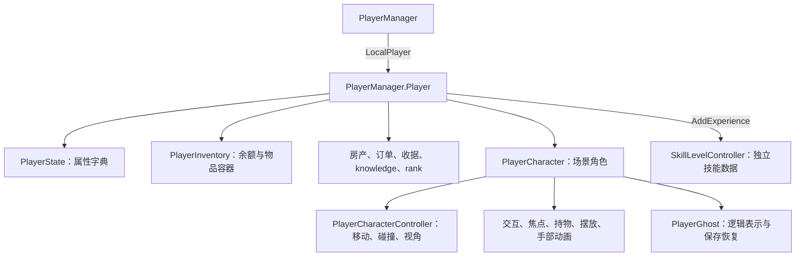

# Nivalis Nights：Player 底层调查

日期：2026-09-30。分析对象：逻辑程序集 `Assembly-CSharp.dll` 对应的元数据，以及 `GameAssembly.dll` 中的 x64 机器码。

## 1. 结论与证据范围

**Player 由业务玩家、场景角色、控制器、属性状态、库存、技能管理器与 Ghost 存档表示共同组成。** 目前已从入口追到字段读写、时间驱动的属性计算、移动与碰撞分支、技能经验门槛、经营评分公式及专用存档调用链。

本轮实际完成：

- 重新计算游戏 DLL、metadata 与分析映射的 SHA256；游戏两个输入与既有验证记录一致。
- 在 Assembly-CSharp 的类型范围内，按“类型名包含 Player 或命名空间等于 Nivalis.Player”检出 134 个类型条目，包含嵌套/生成类型，不等于 134 个独立玩法系统。
- 摘录 56 个玩家及支撑类型、970 条关联方法映射。该数字包含共享方法地址，不代表独立原生函数数量。
- 用 Capstone 5.0.6 从磁盘 PE 生成 75 份方法指令记录，覆盖 74 个唯一入口 RVA；重点核对下述方法的字段访问、分支、直接调用和原生调用名称。没有恢复完整 C# 源码，也没有声称逐一确认了全部 970 条映射的行为。
- 全程为静态分析；没有附加进程、运行游戏内调用、修改游戏文件、部署插件或修改游戏存档。

本文证据等级：**静态已验证**＝元数据与相关指令相互支持；**元数据已确认**＝字段、类型和方法签名存在；**推断/未验证**会单独说明。运行时实例、资产配置值与游戏内表现仍待验证。

IL2CPP MCP 的 `list_dumps` 调用没有执行：自动审批服务返回 403，称无权访问其配置的模型，导致审批无法完成。这是审批服务故障，不是安全性判定。本轮没有改用直接 stdio 或其他通道重试该 MCP 操作，后续使用的是已有本地导出和只读磁盘分析。

## 2. Player 的对象分层



`PlayerManager.Player` 是普通业务对象，实现 `IShopUser / ISkillUser / IPropertyOwner`；`PlayerCharacter` 才继承 `BaseCharacter → MonoBehaviour`。`BaseCharacter` 提供 Animator、Transform 缓存、可见性与对象池生命周期等能力。

本版本字段关系如下。偏移只用于解释本次机器码，不能作为跨版本固定地址方案，也不是当前进程中的地址。

| 所属对象 | 字段 | 本版本偏移 | 职责 |
|---|---|---:|---|
| PlayerManager | `_localPlayer` | `0x18` | 本地业务玩家 |
| Player | `OrderMadeByPlayer` | `0x38` | 当前制作订单 |
| Player | `Id` backing field | `0x40` | 玩家 ID |
| Player | `CurrentProperty` backing field | `0x48` | 当前房产 |
| Player | `_state` | `0x50` | 属性集合 |
| Player | `_character` | `0x58` | 场景角色 |
| Player | `_ownedProperties` | `0x60` | 房产标识 HashSet |
| Player | `stats` | `0x68` | PlayerStat 配置列表 |
| Player | `playerPrefab` | `0x70` | 角色预制体 |
| Player | `inventory` | `0x78` | 库存与余额 |
| Player | `personalReceipts` | `0x80` | 个人账目 |
| Player | `knowledge` | `0x88` | 九个知识/功能标志 |
| Player | `rank` | `0x94` | 经营评分 |
| PlayerCharacter | `_controller` | `0x70` | 角色控制器 |
| PlayerCharacter | `_myGhost` | `0xE0` | PlayerGhost |

前三个重要对象 getter 与本地玩家 getter 已核对为直接字段读取。更具体的是：`PlayerManager.GetPlayer(int id)`（RVA `0x2F0DF90`）在 `id == 0` 时返回 `_localPlayer`，其他 ID 返回 null。这里只确认该入口的单本地玩家行为，不据此评价整个程序是否具有任何网络相关代码。

元数据入口：[Player 类](/D:/NightsHack/work/il2cpp-validation/dump.cs:714269)、[PlayerManager](/D:/NightsHack/work/il2cpp-validation/dump.cs:714591)、[PlayerCharacter](/D:/NightsHack/work/il2cpp-validation/dump.cs:714937)。

## 3. 两条更新链：属性时间与场景角色

### 3.1 属性循环

**静态已验证：** `PlayerManager.Update` → `_localPlayer._state.Update()`。该调用在原生代码中是到 `PlayerState.Update` 的尾跳转。

状态存储为：

```text
PlayerState._statValues : Dictionary<PlayerStat, PlayerState.StatValue>
PlayerStat             : name、valueRange、changeOverGameSecond、startValue
StatValue              : Nullable<int> LastUpdateTime、float Value
```

`PlayerState` 构造函数遍历配置列表，为各属性建立 `StatValue`，将 `Value` 设为该配置的 `startValue`，`LastUpdateTime` 初始为空。`Player.Initialize` 中可见创建这个状态对象并写入 `_state` 的过程。

`PlayerState.Update`（RVA `0x2DCE250`）的普通有限数值路径可概括为以下**依据指令整理的伪代码**，不是恢复的原始源码：

```csharp
foreach (var (stat, state) in statValues)
{
    if (state.LastUpdateTime.HasValue)
    {
        int elapsed = TimeOfDayManager.TotalGameSeconds - state.LastUpdateTime.Value;
        if (elapsed > 0)
        {
            state.Value = Clamp(state.Value + elapsed * stat.changeOverGameSecond,
                                stat.valueRange.x, stat.valueRange.y);
            OnStatChanged?.Invoke(stat, state);
        }
    }
    state.LastUpdateTime = TimeOfDayManager.TotalGameSeconds;
}
```

这意味着首次更新建立时间基准；正的游戏秒差才进入计算与通知路径。即使速率为零或结果已到上下限，该路径也没有“值没变就不通知”的比较。

**重要差异：** `SetStat(PlayerStat,float)`（RVA `0x2DCE4F0`）通过字典取得已有 `StatValue`，直接写入 `Value` 并发送 `OnStatChanged`。这个方法本身没有 Clamp，也不重置 `LastUpdateTime`。自动变化写字段时没有调用 `SetStat`，所以只观察 `SetStat` 不能覆盖全部属性变化。

`DEV_SetStat` 是已有开发入口。具体有哪些配置实例、它们是否叫饥饿/体力/健康，以及其真实范围和速率，**目前未知**：这些值由 PlayerStat 资产提供，不能从通用字段名杜撰。所查核心 Player 类没有独立的 `Health` 字段，不能由此断言整个游戏不存在健康或受伤系统。

证据：[属性 Update 指令](/D:/NightsHack/work/player-investigation/asm/Nivalis.PlayerState__Update_2DCE250.txt)、[SetStat 指令](/D:/NightsHack/work/player-investigation/asm/Nivalis.PlayerState__SetStat_2DCE4F0.txt)、[配置元数据](/D:/NightsHack/work/il2cpp-validation/dump.cs:717218)。

### 3.2 场景角色循环

`PlayerCharacter.Update`（RVA `0x9C0710`）中的主要调用顺序已从指令核对，实际执行受初始化状态及各分支约束：

```text
PlayerCharacter.Update
  → Controller.ManualUpdate(drivenBoat)
  → CinemachineBrain.ManualUpdate
  → CameraController.UpdateCameraZooming / UpdateFocusTarget
  → HandsAnimator.ManualUpdate
  → ObjectHolder.ManualUpdate
  → onHoldableUpdate
  → PlacementSystem.ManualUpdate
  → PlayerInteraction.ManualUpdate
  → IK Solver 更新
  → 将场景 Transform 同步到 Ghost.Transform
```

场景位置和 Ghost 中的逻辑位置具有同步关系；后者也会参与保存与恢复。不能把任意一个对象中的坐标写入当作完整传送实现。

## 4. 移动、NoClip、传送与控制锁

### 4.1 真实执行链和速度

**静态已验证：** `ManualUpdate → UpdateMovement → Move`。正常移动最终进入原生调用 `UnityEngine.CharacterController::Move_Injected(Vector3&)`；另有玩家自定义 NavMesh 和位置有效性检查。

主要速度字段：`defaultMoveSpeed`、`sprintSpeed`、`_moveSpeedScale`、`_isSprinting`。`UpdateMovement` 的基础速度选择为：

```text
speed = (_isSprinting ? sprintSpeed : defaultMoveSpeed) * _moveSpeedScale
NoClip 分支再乘 3
```

- `get__moveSpeed` 返回 `defaultMoveSpeed * _moveSpeedScale`。
- `SetPlayerSpeed(x)` 实际写入 `_moveSpeedScale = x / defaultMoveSpeed`，本方法未见零分母检查。
- `get_MaxSpeed` 只返回 `sprintSpeed`，没有乘 `_moveSpeedScale`，也没有计算 NoClip 的倍率。因此该属性名不等于此时真实最大速度。
- 构造函数写入步行 `3.0`、冲刺 `6.0`、gravity 与 groundSnapping 为 true。它们是代码初始化值；序列化资产可覆盖，不能当作当前游戏实例的已测数值。
- `ManualUpdate` 在移动锁允许且 `Time.timeScale > 0` 时调用 `UpdateMovement`，传入 `min(Time.unscaledDeltaTime, 0.1f)`。这条移动积分时间与 PlayerStat 使用的 `TotalGameSeconds` 不同。

普通模式把输入方向的竖直分量清零并归一化。重力分支读取 Unity `Physics.gravity`；无自定义 NavMesh 且重力启用、非 NoClip 时累积竖直速度。位移使用旧/新竖直速度的均值乘时间步长。随后处理地面检测、贴地及 head bob。贴地分支可见 `GetGroundDistance() - 0.01` 的比较，只有正差值且不超过 `0.5` 等条件满足时才继续；不能简化成每帧无条件吸附地面。

### 4.2 内置 NoClip

控制器状态枚举只有 `Normal = 0`、`NoClip = 1`。`ToggleNoClip`（RVA `0x9C18A0`）切换到另一状态并走 `set_State`。

`set_State` 会按是否 Normal 启停底层 Collider；Collider 关闭时清除当前 PlayerNavMesh。`Move` 中 NoClip 分支直接执行 `Transform.position += translation`，与正常的 CharacterController 移动分开。该分支也清理速度相关字段。

NoClip 的额外竖直输入路径检查键值 `19 / 31`；与本地 `UnityEngine.InputSystem.Key` 枚举核对为 **E / Q**，分别贡献 `+1 / -1`。这里竖直附加位移使用 `Time.deltaTime`。这些是静态识别出的开发能力，未测试游戏中如何打开开发菜单或是否有现成热键绑定。

### 4.3 传送的副作用

`TeleportPlayer(Vector3,Quaternion,bool)`（RVA `0x9C8EC0`）包含暂时关闭 Collider、设置位置与旋转、可选 `SnapToGround`、更新 POV 轴值、重新启用 Collider、清理 `_velocity` 等步骤；另有 Transform 参数重载。

**调用边界：** 这个实现可见重新启用 Collider 的写入，不能直接假定它在 NoClip 中调用后仍保持原控制状态。完整调用场景、NavMesh/船只一致性和保存后的落点仍需运行验证。

### 4.4 多持有者控制锁

`_canMove / _canSprint / _cameraLookEnabled / _interactionActive` 使用 `OverrideableBool`，并非同一个普通布尔字段。它持有默认值与 owner 集合；`get_Value` 的逻辑是“集合非空时取默认值的反值，否则取默认值”。多加几个 owner 不会反复翻转。

`DisableMovement`、`DisableSprint`、`LockCamera`、`DisableInteractions` 返回 `OverrideLock`；`Release` 走 owner 释放路径。`PlayerObjectHolder.GrabPlayerLocks` 确认会申请冲刺限制，`ReleasePlayerLocks` 释放自己的锁。

一个需要保留的差异：`ManualUpdate` 的 Hold 冲刺分支显式检查 `_canSprint` 后读取 `IsPressed`；Toggle 分支读取 `WasPressedThisFrame` 并翻转状态，在所查该分支未见同样的锁判断。因此不能把 `_canSprint` 描述成所有输入模式都已验证一致生效。未在游戏内复现该差异。

证据：[移动计算](/D:/NightsHack/work/player-investigation/asm/Nivalis.PlayerCharacterController__UpdateMovement_9C5FA0.txt)、[最终 Move](/D:/NightsHack/work/player-investigation/asm/Nivalis.PlayerCharacterController__Move_9C66A0.txt)、[控制器 ManualUpdate](/D:/NightsHack/work/player-investigation/asm/Nivalis.PlayerCharacterController__ManualUpdate_9C5220.txt)、[锁的取值逻辑](/D:/NightsHack/work/player-investigation/asm/Nivalis.OverrideableBool__get_Value_31D5330.txt)。

## 5. 交互、持物、相机与玩家顾客行为

### 5.1 交互分派

`FocusRaycaster` 的元数据包含焦点距离、半径、图层、排除对象，以及物体/可交互对象/可持物体列表。`PlayerInteraction.UpdateInteractable` 先清空当前焦点，在交互锁允许、焦点列表非空且玩家未持物时调用 `FindInteractable`。

`OnInteraction` 的指令检查交互有效、当前目标非空、光标模式未激活、玩家没有持物，然后分派 `IInteractable` 的 **slot 5：DoInteraction()**，最后触发 `OnInteract`。具体目标各自实现动作，不由 Player 一个方法包办。

`PlayerObjectHolder` 有拾取、释放、收进容器、旋转及手中物体跟随等入口；`PlacementSystem` 负责摆放，`PlayerHandsAnimator` 负责手部/IK。除上述主调用和冲刺锁外，这些功能的完整碰撞/库存事务规则尚未逐个恢复。

### 5.2 相机与环境

元数据及帧更新调用确认：第一人称 POV、Cinemachine 相机、对话相机、缩放、景深、焦点目标、视角/位置偏移、head bob、手部可见性及相机锁。

`PlayerEnvironmentTracker` 提供室内/室外比例、是否在室内、最近场所与距离，并有屋顶检测、房产检测和环境体积入口。`PlayerNavMesh` 提供贴合网格、障碍物检测、最近三角形点和进入/离开事件；这些几何算法本轮未完整解码。

### 5.3 PlayerGhost 的顾客玩法

`PlayerGhost : CustomerGhost : Ghost`；字段和方法涉及坐下/起立、座椅预留、点单、选餐、支付、餐厅、上次睡眠公寓与视角旋转。

指令进一步确认：`SitDown` 会在 `PlayerInputManager.PreventSaving` 上申请锁并存到 `preventSavingWhileSittingLock`；涉及座椅释放/预留，以及营业中场所的接单任务入队。起立路径有释放座椅、清订单和释放锁。`PayForOrder` 中可见 RestaurantReceipt 处理与最终 `PlayerInventory.set_Money` 调用。完整计价与异常回滚未验证。

## 6. 技能、经营、订单与知识标志

### 6.1 技能经验独立存储

`Player.AddExperience(skill,exp)` 把自身 Id 与经验传给 `SkillLevelController`。后者持有独立的 `PlayerExperience.PerSkillExperience : Dictionary<Type, PlayerSkillExperience>`；每项为 `float Experience + int CurrentLevel`。

**静态已验证：** 增加经验入口读取旧记录、加上传入经验、调用技能定义的 `GetLevelForExperience`、写回新记录并通知 `OnPlayerExperienceUpdated`。等级变化且技能提供奖励信息时会构造并显示升级祝贺数据。所查实现使用单个 `_playerData`，事件传出的 playerId 是 0；不能仅凭方法带 playerId 参数推断存在多玩家数据表。

已核对 `SkillLevels<CookingLevel>.GetLevelForExperience(float,out float)` 的共享原生体：从等级数组索引 1 开始逐级比较并减去 `RelativeExperienceRequired`，不足下一门槛时返回前一级，达到末尾返回最后一级，并输出剩余经验。它是逐级门槛累加模型，**没有从代码里发现一个可直接代替资产配置的统一指数公式**。

此入口与 Barter、Boat、Cleaning、Cooking、Farming、Fishing、Management、Managing、Serving、Social 等泛型实例共享地址；具体门槛、等级数量和收益来自各技能资产。`ManagementLevel` 与 `ManagingLevel` 都有符号，不能仅凭名字将二者合并为同一个技能配置。

技能存档走 `SkillLevelController.SkillLevelsControllerSave`，其字典 key 是 string；`WriteToPacket` 中可见由运行时技能 Type 查 SkillDefinition 后转写存档的过程，不在 PlayerSave 里直接写一份玩家总经验。

证据：[经验入口](/D:/NightsHack/work/player-investigation/asm/Nivalis.SkillSystem.SkillLevelController__AddExperience_2FEB820.txt)、[等级门槛算法](/D:/NightsHack/work/player-investigation/asm/Nivalis.SkillSystem.SkillLevels_CookingLevel___GetLevelForExperience_1226B60.txt)。

### 6.2 rank 是经营评分

`Player.UpdateRank`（RVA `0x2D05CA0`）取得玩家房产，筛出 Venue，累计其 tier、运行数据的 AveragePopularity 及特定游戏日的 DayIncome 返回值，然后计算：

```text
rank = RoundToInt(100 × Σtier + 300 × ΣAveragePopularity + 0.01 × ΣDayIncome)
```

随后写入玩家 `rank`，并通过 Articy 的 `SetVariableByString` 同步到 **GameState.BossRanking**。其中 DayIncome 不能改称“净利润”；其内部收入聚合公式本轮未展开。

`OnCurfewStart` 会通知取消当前订单、清空订单，并进入 UpdateRank。`OnDayUpdate` 遍历场所，并通过带 `ManagementLevel` 的泛型方法信息调用经验入口；该过程的全部奖励数值条件尚未整理成完整公式。

证据：[经营评分指令](/D:/NightsHack/work/player-investigation/asm/Nivalis.PlayerManager.Player__UpdateRank_2D05CA0.txt)。

### 6.3 制作订单与顾客点单要区分

Player 业务对象自己的 `OrderMadeByPlayer` 带 `OrderData`，其结构是按 `FoodItemType` 分组的制作步骤列表。每个步骤有 `isDone / processingType / timeToProcess`。

步骤枚举包括烤箱、炉灶、烤架、研磨机、平底锅、炸锅、搅拌机、取食材、食品处理器和饮料处理器。

`MakePreparationStep(stepType)` 静态确认的条件为：当前订单存在 → 当前步骤存在 → 类型相同 → 标记该步骤完成 → 发 OnStepDone → 检查订单是否完成 → 发 OnOrderCompleted 并清空订单。这个方法本身没有用 `timeToProcess` 做耗时判断；耗时约束可能在调用方，不能宣称整个制作过程没有计时。

这套制作进度不同于 PlayerGhost 作为餐厅顾客时的座位/选餐/付款状态。Player 还提供买入、三个卖出重载、付租、个人收据、日/总收支、房产/场所归属、进入公寓/场所/温室等业务入口。

本轮购买入口另外核对到余额比较、物品转移返回值分支、负金额 ShopTransactionReceipt、`set_Money` 和 Barter 经验调用。转移 helper 和所有买卖重载的回滚语义未完全解码。

### 6.4 knowledge 的九个标志

元数据确认 `PlayerKnowledge` 包含：`fishing`、`trading`、`navigation`、`map`、`inspiration`、`storage`、`farming`、`renting`、`hiring`。PlayerSave.Save 可见逐字节读取这九个 bool 并写出。

**推断：** 这些字段与对应知识/功能解锁有关。各标志实际限制哪个菜单、教程或剧情分支，尚未逐一追踪读取者，不能保证单独改一个 bool 就完成全部解锁。

## 7. 存档不是只存一个 Player 对象

已确认的调用链：

```text
PlayerManager.WriteToPacket
  ├─ PlayerSave.GetSaveDataFromPlayer(LocalPlayer) → packet.PlayerSave
  └─ LocalPlayer.Character.MyGhost               → packet.PlayerGhost

PlayerManagerSave.Save
  ├─ Ghost.Save(PlayerGhost)
  │    ├─ Ghost 基础身份、场景、位置、旋转等
  │    └─ 虚分派 PlayerGhost.SaveInternal → LookRotation
  └─ PlayerSave.Save
       ├─ Money
       ├─ OwnedProperties
       ├─ knowledge 九个 bool
       ├─ personalReceipts
       └─ currentPropertyGuid
```

`PlayerGhost.get_IsPartOfSaveFile()`（RVA `0x4E9520`）机器码确实是返回 false；但 `PlayerManagerSave.Save` 直接调用 `Ghost.Save`，因此该标志**不能用于判断玩家是否完全不保存**。专用保存路径已静态确认；它与世界里通用 Ghost 的收集机制如何配合，未追完整。

PlayerSave 的字段和写入流程没有 PlayerState 属性字典，也没有技能经验字典。Player.Initialize 会按 stats 配置新建 PlayerState；技能另有管理器存档包。由此可以区分存储职责，但尚不能断言属性数值在整个游戏中绝不通过其他系统恢复。

保存→退出→重新加载的完整往返未执行。坐下时的 PreventSaving 锁也说明不能不顾状态直接触发任意保存。

证据：[专用包保存](/D:/NightsHack/work/player-investigation/asm/Nivalis.PlayerManagerSave__Save_2F0E3F0.txt)、[Ghost 基础保存](/D:/NightsHack/work/player-investigation/asm/Nivalis.GhostSystem.Ghost__Save_305D990.txt)、[PlayerSave 保存](/D:/NightsHack/work/player-investigation/asm/Nivalis.PlayerManager.PlayerSave__Save_2D086A0.txt)。

## 8. 后续定位入口与证据边界

这些入口可用于继续分析或设计观察点；本轮没有安装任何新 hook，也没有验证调用所需实例/线程条件。

| 目标 | 类与方法 | 当前 RVA | 需要保留的边界 |
|---|---|---:|---|
| 本地玩家 | PlayerManager.GetPlayer(int) | `0x2F0DF90` | 仅 ID 0 返回 LocalPlayer |
| 属性自动更新 | PlayerState.Update | `0x2DCE250` | 字典遍历、游戏时间、范围限制、事件 |
| 显式设属性 | PlayerState.SetStat | `0x2DCE4F0` | 无自动 Clamp，不能覆盖直接更新路径 |
| 移动入口 | PlayerCharacterController.ManualUpdate | `0x9C5220` | 输入模式、船、锁、暂停状态 |
| 运动积分 | PlayerCharacterController.UpdateMovement | `0x9C5FA0` | 速度、重力、时间步长、贴地 |
| 实际位移 | PlayerCharacterController.Move | `0x9C66A0` | Normal/NoClip 两条路径、自定义 NavMesh |
| 切换 NoClip | PlayerCharacterController.ToggleNoClip | `0x9C18A0` | 走 State setter，同时改变 Collider/NavMesh |
| 速度开发入口 | PlayerCharacterController.SetPlayerSpeed | `0x9C2110` | 设置倍率，非直接替换 sprintSpeed |
| 传送 | PlayerCharacterController.TeleportPlayer(Vector3,Quaternion,bool) | `0x9C8EC0` | 多个副作用，不能只写坐标 |
| 交互执行 | PlayerInteraction.OnInteraction | `0x2F0B610` | 焦点、锁、光标、持物及接口分派 |
| 制作一步 | Player.MakePreparationStep | `0x2D01CA0` | 当前步骤类型、完成事件与订单清理 |
| 技能经验 | SkillLevelController.AddExperience | `0x2FEB820` | 等级重算、通知和升级展示 |
| 技能等级门槛 | SkillLevels<CookingLevel>.GetLevelForExperience(float,out float) | `0x1226B60` | 泛型共享地址，门槛来自资产 |
| 经营评分 | Player.UpdateRank | `0x2D05CA0` | 会同步 Articy 剧情变量 |
| 玩家保存 | PlayerManager.WriteToPacket / PlayerManagerSave.Save | `0x2F0DE70 / 0x2F0E3F0` | 业务快照与 Ghost 分开保存 |

优先按程序集、类型及完整方法签名动态识别；RVA 用于当前版本核对。不要把单个共享 getter 的地址当作某个 Player 类的唯一方法标识。

仍未确认：当前实例地址、运行时配置的具体属性名称/阈值、所有技能资产数值、输入模式差异的游戏内效果、完整交易异常处理、存档往返，以及 Unity 原生引擎内部的碰撞求解实现。当前深度已到 Assembly-CSharp 发起的原生引擎调用边界，没有把引擎 API 名称当作引擎内部算法已经反编译的证据。

反汇编方法采用已映射入口和下一已映射入口作为上界，沿可达指令解码；PE `.pdata` 只作为 unwind 片段记录，因为同一方法可有多个片段。异常 funclet、间接分派和未解析的跳转可能不完整。泛型共享函数依据传入的 MethodInfo 和上下文识别，不能信任注释中第一个别名。泛型定义的 dump 字段偏移也不一定是实例布局，例如 SkillLevels 的 levels 在定义摘录中显示 `0x0`，本次已查泛型实例指令实际使用 `this+0x38`。

## 9. 证据文件与复查

| 文件 | 内容 |
|---|---|
| [类型摘录脚本](/D:/NightsHack/work/player-investigation.py) | 类型筛选、原始行号、方法映射与输入哈希 |
| [指令提取脚本](/D:/NightsHack/work/player-disassemble.py) | 只读 PE、x64 可达指令解码、调用与常量注释 |
| [输入身份](/D:/NightsHack/work/player-investigation/input-hashes.json) | DLL、metadata、dump.cs、script.json 的 SHA256 |
| [Player 类型索引](/D:/NightsHack/work/player-investigation/player-type-index.json) | 134 条类型的名字、TypeDefIndex、来源行 |
| [所选类型简表](/D:/NightsHack/work/player-investigation/selected-types-brief.txt) | 字段与方法概览 |
| [方法映射](/D:/NightsHack/work/player-investigation/selected-methods.json) | 970 条原始签名与地址记录 |
| [反汇编索引](/D:/NightsHack/work/player-investigation/disassembly-index.json) | 75 条方法记录、调用边与未解析间接分派 |
| [分析状态](/D:/NightsHack/work/player-investigation/analysis-status.json) | 工具限制、分析范围与检查结果 |

逐方法原始字节与指令在 `D:/NightsHack/work/player-investigation/asm/`，各有 JSON 和 TXT；方法请求清单为同目录上一级的 `method-requests.json`。

分析 Python 依赖只安装在 `D:/NightsHack/work/analysis-python`，未改项目编译依赖或游戏目录。复查命令：

```powershell
Set-Location D:/NightsHack
& 'C:/Users/Administrator/.cache/codex-runtimes/codex-primary-runtime/dependencies/python/python.exe' work/player-investigation.py
& 'C:/Users/Administrator/.cache/codex-runtimes/codex-primary-runtime/dependencies/python/python.exe' work/player-disassemble.py
```
