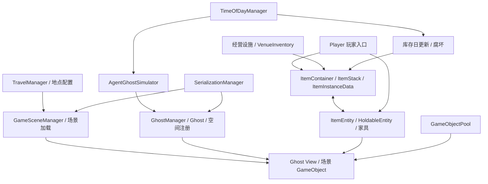

# World 底层调查与后续钩子参考

> 后续实现（2026-09-30）：本报告完成后的封装已交付 WorldHook、ItemHook、GameRuntimeHook，见 [HOOKS-REFERENCE.md](D:/NightsHack/outputs/HOOKS-REFERENCE.md)。下文“本轮未实现 WorldHook”描述的是原始逆向阶段；后续插件也仅观察，未部署、未做游戏内验证。


日期：2026-09-30。目标：Nivalis Nights / Windows x64 / Unity IL2CPP。

本轮完成静态结构、原生指令和调用关系调查；没有实现 WorldHook，没有更改 PlayerHook 或游戏逻辑，没有部署、附加进程或做游戏内验证。

## 1. 结论与证据范围

**World 是多个系统共同组成的职责域，不是一个包含所有东西的 World 类。Item 的权威数据属于 `Nivalis.InventorySystem`，通过 ItemEntity、HoldableEntity、家具与经营库存接入世界。** PlayerHook 已有玩家操作入口，但不等于覆盖 Player 的全部方法，也不等于覆盖下面这些世界底层。

本轮产物与计数：

- 广义关键词定位 663 个相关类型；其中 509 个类型生成单独声明摘录，关联 3,951 条原生符号记录。这包含 UI、配置、工具及外围类型，**不能当作 663 个已逆向完成的世界核心类**。
- 整理 71 个重点类型的声明目录，包含核心数据、接口、世界视图、经营设施与关键协程。
- 对 202 条方法记录、194 个不同 RVA 提取可达指令，合计 31,077 条指令记录。存在共享函数体；不是 202 个完整恢复的 C# 方法。
- 额外核对场景加载与旅行协程的跳转表，分别补入 14 和 6 个表项对应的分支入口，避免只看到 MoveNext 的分派前半段。

本文证据标签：**原生核对**表示相关指令/调用已检查；**结构确认**表示元数据声明已确认，未逐分支恢复实现；**推论**表示由这些事实推导的开发建议。所有运行效果均未进行游戏内验证。

核心证据：

- [71 类字段与方法声明目录](D:/NightsHack/work/world-investigation/focused-catalog.md)
- [方法签名、RVA、调用边、未解析调用索引](D:/NightsHack/work/world-investigation/disassembly-index.json)
- [直接调用摘要](D:/NightsHack/work/world-investigation/call-summary.txt)
- [广义类型索引](D:/NightsHack/work/world-investigation/world-type-index.json)
- [分析请求清单](D:/NightsHack/work/world-investigation/method-requests.json)

各方法带机器码的文本与 JSON 位于 `D:/NightsHack/work/world-investigation/asm/`；文件名为“完整类名__方法名_RVA”。声明目录保留 `dump.cs` 原始行号。本文简称省略 `Nivalis`；完整命名空间、重载及参数以目录/索引为准。

## 2. 系统地图

| 职责 | 核心类 | 逻辑与主要执行入口 | 本轮深度 |
|---|---|---|---|
| 地点与场景生命周期 | GameSceneManager、WorldLocation、TransitionManager | LoadArea、UnloadArea、LoadSceneObjects、LoadAreaRoutine.MoveNext、TransitionRoutine.MoveNext | 原生核对关键路径 |
| 旅行与解锁 | TravelManager、TravelPortal、PortalKey、TravelConnection、TravelUnlockManager | RequestTravel、TeleportPlayer.MoveNext、FindShortestPath、UnlockLocation、VisitLocation | 原生核对入口/调用；寻路算法未完整还原 |
| 世界逻辑对象 | GhostSystem.Ghost、GhostManager、ScenePositionalRegistry | 注册/注销队列、空间索引、位置变化、跨场景迁移 | 原生核对 |
| 逻辑对象的场景表现 | StaticGhostViewBase、BuildTimeSceneGhosts、GhostManager | Link/Unlink、InstantiateGhostViewIfNeeded、UpdateGhostViewPresence | 结构及关键原生路径 |
| 物品定义与单件数据 | InventorySystem.ItemType、ItemInstanceData | CreateStack、UpdateDecay、Freshness、Save/Load | 字段及腐坏算法原生核对 |
| 堆栈与库存 | ItemStack、ItemContainer、ItemContainerRestriction、InventoriesManager | TryAdd/TryTake、TryCreateInInventory、合并拆分、限制、DayChange、存取 | 结构及关键原生路径 |
| 拾取、持有与摆放 | ItemEntity、ItemCollectible、HoldableEntity、PlacementTracker/Setting/Spot/Slot | Store、DoInteraction、PickUp、Place、碰撞/产权/父节点校验 | 关键原生路径；摆放全规则未穷尽 |
| 家具与地产 | Locale.FurnitureObject、CustomerLoop.BaseProperty、Apartment/ApartmentManager、Greenhouse/GreenhouseManager | 产权、展示出售、区域归属、室内/温室管理 | 家具关键路径；其余主要结构确认 |
| 经营与顾客 | Venue、VenueManager、VenueAreaGhost、VenueInventory、VenueFinances、CustomerGhost | 普通/冷藏库存、容量、每日利润、员工支付、顾客实体 | 主要结构确认，未完成经营公式逆向 |
| 世界时间与模拟 | TimeOfDayManager、Ai.AgentGhostSimulator、GhostSimulator、AgentGhost | AddTime、OnTimeUpdate、UpdateAgentActions、SkipTime | 时间入口及跳时循环原生核对 |
| 天气与昼夜 | WeatherForecastController、Weather.WeatherManager、DayNightCycle.LightCycleManager | 预报选择、场景覆盖、局部天气、天空与光照更新 | 预报控制器直接调用核对；渲染内部未穷尽 |
| 任务世界对象 | Dialogue.WorldObjectGhost、WorldObjectView、ArticyImportedWorldObj、SetWorldObjActive、WorldPointManager | Use、显示/交互状态、任务点激活与撤销 | 结构及关键原生路径 |
| 存档与对象池 | SerializationManager、SavedObject、SerializableObject、ManagersSave、GameObjectPool、PooledElement | Save/LoadRoutine、对象恢复、池化申请/归还、卸载前释放 | 关键原生路径 |



图表示职责与数据联系，不保证每条线都是直接调用，也不表示所有 ItemEntity 都继承 Ghost。

## 3. 场景、地点和旅行

**结构确认：** `WorldLocation` 是 ScriptableObject 配置，保存 guid、SceneReference、defaultPortal、sceneIndex 和 transitions 等。它不是整个世界的实时对象容器。`GameSceneManager` 保存地点列表、场景索引到地点的映射、当前游戏场景和加载操作状态。

**原生核对：** `WorldLocation.get_SceneIndex`（`0x2F9DC80`）会进入 Unity 的按路径解析 BuildIndex 接口；`get_SceneIsLoaded`（`0x2F9DD00`）查找场景并读取其加载状态。不能把“地点配置存在”当成“场景已经加载”。

`TravelManager.RequestTravel` 的带 BoatGhost 重载（`0x2E632D0`）可见：处理船只、暂停时间、申请 OverrideLock、调用 `GameSceneManager.LoadArea`、启动协程和记录 VisitLocation 等路径。旅行不只是写玩家坐标。

`GameSceneManager.LoadArea`（`0x317B5F0`）是入口。实际异步执行在 `GameSceneManager.<LoadAreaRoutine>d__85.MoveNext`（`0x2D68E50`），已确认其中存在：

1. 淡出、加载 UI、场景加载开始事件。
2. `PooledElement.ReleaseAllBeforeUnloadingScene`、`SceneManager.UnloadSceneAsync` 和 `Resources.UnloadUnusedAssets`。
3. 异步加载目标场景，检查 progress/isDone，控制 allowSceneActivation。
4. `LoadSceneObjects`、设置 ActiveScene、光照探针 Tetrahedralize。
5. 等待加载阻塞解除、淡入和完成事件。

上面是阶段划分；重载、条件分支、等待与错误路径会改变具体顺序，不能按调用摘要的排列直接重建源码。

`TravelManager.<TeleportPlayer>d__15.MoveNext`（`0x2D920F0`）还关联玩家传送、NavMesh 对齐、公寓进入/退出和锁释放。只观察返回 IEnumerator 的包装方法，看不到后续每次恢复执行。

`FindShortestPath`（`0x2E63FF0`）确认调用 `IsLocationUnlocked`；签名带 `checkIfLocationUnlocked=true`。**尚未证明具体采用 BFS、Dijkstra 或其他完整算法，不依据方法名下结论。**

后续钩子应分开记录“请求开始、协程阶段、加载完成、位置最终确定”。进入请求函数不等于旅行成功。

## 4. Ghost：比场景 GameObject 更底层的世界对象

这里 Ghost 是游戏逻辑实体的名称，不是敌人类别。

| 对象/字段 | 本版本实例偏移 | 作用 |
|---|---|---|
| Ghost.id / prefabId | `0x20 / 0x28` | 逻辑身份与预制体身份 |
| IsValid / IsActive / isViewLess | `0x30 / 0x31 / 0x32` | 有效性、活动标记、无视图状态 |
| sceneIndex / LastSceneIndexRegistry | `0x34 / 0x38` | 当前场景与上次注册场景 |
| LastCellRegistry | `0x3C` | 空间网格坐标 |
| transform | `0x70` | PositionRotation 数据 |
| viewId / loadedView | `0x90 / 0x98` | 视图标识及已加载视图引用 |
| GhostManager 场景注册表 / Ghost ID 表 / View ID 表 | `0x68 / 0x70 / 0x78` | 多级索引 |
| GhostManager.CellSize | `0x88` | 空间网格尺寸 |
| 注销队列及双缓冲 / 注册队列及双缓冲 | `0xA8,0xB0 / 0xB8,0xC0` | 延迟操作处理 |

这些偏移只用于本次静态布局核对，不是未来修改器的固定地址接口。

### 注册与注销

`RegisterGhost`（`0x3061C50`）设置有效性并入注册队列，**不是立即完成全部注册**。`FlushGhostOperationQueues`（`0x305FF70`）切换缓冲，先处理注销，再处理注册。实际工作分别进入 `DeregisterGhostImmediate`（`0x30602E0`）和 `RegisterGhostImmediate`（`0x30609D0`）。

立即注册路径关联位置注册、视图实例化与事件；注销路径关联空间移除、清除视图、池归还或 Unity Destroy。未来观测必须区分 queued 与 applied，避免把刚入队对象当成已稳定可用。

### 位置与空间网格

`Ghost.set_Transform`（`0x305D140`）和 `set_Position`（`0x305D1E0`）进入 `GhostManager.UpdatePosition`（`0x305FB40`）。后者按 XZ 平面计算网格：

```text
cellX = truncateTowardZero(position.x / CellSize)
cellZ = truncateTowardZero(position.z / CellSize)
```

原生指令是浮点除法和 `cvttss2si`，**不是向下取整 Floor**，负坐标尤其不同。场景和格子均未改变时可提前返回；变化时更新注册信息并调用空间注册表操作。

`set_SceneIndex` 本身是简单字段 setter，不能替代迁移。`TransferGhostToScene`（`0x3061EB0`）包含视图状态切换、场景/变换数据更新、UpdatePosition，最终恢复 `IsViewLess=false`；特殊路径还注销 SavedObject。因此跨场景移动应保留原迁移链，而非只写 sceneIndex。

### 逻辑对象与视图分离

`InstantiateGhostViewIfNeeded`（`0x3061110`）检查已有视图和目标场景加载状态，涉及 SavedObject、预制体实例与对象池。`UpdateGhostViewPresence`（`0x30623F0`）可创建视图，也可归还/销毁并清除视图引用。

**推论：** Ghost 存在并不保证当前有可见 GameObject。世界枚举不能仅靠当前场景的 Transform；同时也不能假设所有场景物体都是 Ghost。

## 5. Item 真正的数据链

```text
ItemType（共享物品定义）
  ↓ type 引用
ItemInstanceData（逐件数据：价值、创建日、剩余腐坏时间、更新日）
  ↓ List<ItemInstanceData>
ItemStack（同类堆栈）
  ↓ LinkedList<ItemStack> + 类型索引
ItemContainer（库存、限制、冷藏标记、内容变更事件）
  ↔ ItemEntity / 拾取物 / 玩家库存入口 / VenueInventory
```

### 数据布局

| 类 | 重要字段及本版本偏移 | 含义 |
|---|---|---|
| ItemType | guid `0x18`、basePrice `0x38`、baseMarketPrice `0x4C`、isPlayerStorable `0x60`、tags `0x68`、entityPrefab `0x80` | 定义、价格及世界实体配置 |
| ItemType | isEquippable `0x88`、isIngredient `0x89`、decayTimeInDays `0x8C`、requiresRefrigeration `0x90` | 装备、食材、腐坏和冷藏规则 |
| ItemType | isUseable `0x104`、onUseStatChanges `0x108`、isFurniture `0x120`、comfort `0x138`、basicStorage `0x13C`、refrigStorage `0x140` | 使用效果、家具、舒适度与储存能力配置 |
| ItemInstanceData | type `0x10`、value `0x18`、creationDay `0x1C`、remainingDecayTime `0x20`、lastUpdateDay `0x24` | 单件物品状态 |
| ItemStack | _lastUpdateTime `0x10`、_type `0x18`、_instanceData `0x20` | 堆栈持有逐件实例列表 |
| ItemContainer | onContentsChanged `0x10`、isRefrigerated `0x20`、isManuallyUpdated `0x21`、typeMap `0x28`、items `0x30`、restriction `0x38` | 冷藏、更新策略、类型索引与堆栈链表 |
| ItemContainerRestriction | MaxItems `0x10`、MaxSlots `0x18`、TagFilter `0x20`、AcceptsIngredients `0x28` | 件数、槽位、类型过滤 |

**原生核对：** `ItemStack.get_StackCount`（`0x3109600`）读取 `_instanceData.Count`。数量不是堆栈上一个可独立修改的 int。ItemCount、StackCount 和限制槽位也不是同一个概念。

**推论：** 修改 ItemType 可能影响共享该定义的所有实例；增加数量应走创建/入库逻辑以建立逐件数据及索引，不能仅伪造 UI 数字或 List.Count。

### 入库、出库与限制

重要入口：`TryCreateInInventory`（`0x3058DC0`）、`TryAdd(ItemStack)`（`0x30580C0`）、`TryAdd(ItemType,List<ItemInstanceData>)`（`0x3058580`）、`TryAdd(ref BasicTemp)`（`0x30589B0`）、TryTake、TakeByType、Clear、UpdateRestriction。

创建入库路径先构建临时物品集合，再进入 TryAdd。入库实现涉及类型限制、可合并堆栈、剩余槽位、新堆栈、类型索引和内容变更通知，不能只盯入口的参数。

返回类型为 `ItemCollectionOperationResult`：`Failed=0`、`Partial=1`、`Succeeded=2`。**不是 bool，部分成功不等于全部成功。** 各重载传入集合的消耗/剩余状态应分别核对，后续命令需同时读取返回值和实际库存变化。

### 腐坏公式：已核对原生指令

`ItemInstanceData.UpdateDecay(bool isRefridgerated,int day)`（`0x3104530`）：

```text
若 type.decayTimeInDays <= 0 或 lastUpdateDay == day：返回
delta = day - lastUpdateDay
loss = (type.requiresRefrigeration 且没有冷藏) ? 2 * delta : delta
remainingDecayTime -= loss
若 remainingDecayTime < 0：置 0
lastUpdateDay = day
```

这意味着需要冷藏而未冷藏时双倍扣减。该方法没有显式拒绝负 delta；直接倒拨日期可能增加剩余时间，不能把时间修改视为无副作用。

`get_FreshnessFactor`（`0x3104480`）是分档系数，不是线性百分比：无腐坏规则返回 1；达到腐坏界限返回 0；剩余时间大于 2 返回 1，等于 2 返回 0.75，其余未腐坏档返回 0.25。`FoodFreshness` 枚举为 Fresh=0、Aging=1、Spoiled=3。

`InventoriesManager.DayChange`（`0x3046210`）遍历库存，跳过标记为手动更新的容器，进入容器腐坏更新。容器/堆栈层还有过期项清理、腐坏物转换及通知路径；仅观察单件 UpdateDecay 不足以表示整个日更新事务。

## 6. 世界实体、拾取、家具和摆放

`InventorySystem.ItemEntity` 保存 `_data:ItemType`（`0x18`）与 `_itemStack`（`0x20`）。**`get_Item`（`0x3102490`）不是纯读取**：未建堆栈时会创建单件数据、初始化日期/保质期并生成堆栈。因此观察钩子的快照不能随意调用 getter。

`ItemEntity.Store`（`0x3102680`）先检查类型是否允许玩家储存；普通物品路径调用集合接口并要求结果等于 2，成功分支销毁世界 GameObject。装备类型有跳过普通入库分支的路径；不能据此宣称装备已在该方法里完整写入装备槽，相关调用者仍需继续核对。

`PlayerObjectHolder.StoreEntity` 是玩家侧入口，负责持有状态、锁和事件等；真正物品变化下沉到实体接口与库存系统。要覆盖玩家以外的物品来源，必须补库存层观察。

`HoldableEntity` 保存 Furniture、ItemEntity、isHeld、beingPlaced、PlacementSpot/Slot、Rigidbody、碰撞器集合与 PlacementTracker。已确认：

- PickUp（`0x840B10`）关联产权/展示出售检查、锁、刚体运动学状态和碰撞器 Trigger 设置。
- Place（`0x841150`）启动协程；`<PlaceRoutine>d__94.MoveNext`（`0x2D23390`）涉及刚体状态恢复、碰撞器恢复、AddForce 和锁释放。
- CheckHasOverlaps → CheckColliderOverlap（`0x841B50`）进入 Unity Physics 的 ComputePenetration 底层接口。
- CheckValidProperty 关联 BaseProperty.PlayerOwned；CheckParentValid 关联玩家 DoesOwnProperty 和 PlacementSnap。

`Locale.FurnitureObject` 另有 CurrentProperty、IsIllegal、AllowPicking、展示出售/供应者状态。家具不是“有坐标的物品 ID”这么简单，摆放牵涉产权、父节点、物理和容量等规则。

经营侧 `VenueInventory` **结构确认**具有两个 ItemContainer：NormalInventory（`0x10`）和 RefridgeratedInventory（`0x18`），分别提供容量/数量接口。`VenueFinances` 记录按日利润，提供 GetProfitsForDay、CalculateProfitsForDay、CalculateStaffPayment。经营公式、公寓租赁、温室作物完整生命周期属于下一层专项，本文不声称已逐分支还原。

## 7. 时间、AI 与天气

`TimeOfDayManager.AddTime`（`0x3148D50`）先累积秒数并把累积值下限钳到 0，再分离整数推进量，经时间变量接口更新。OnTimeUpdate（`0x3149140`）关联静态时间派生值和变更通知。直接写某个静态日期字段不能替代整个通知链。

`AgentGhostSimulator` 存在普通帧更新、时间变化监听、UpdateAgentActions、SwitchAgentAction 和 SkipTime。`SkipTime`（`0x31EFEF0`）包含跳时标记、按最多 1 秒的步长推进动作、按参数决定是否更新模拟器，结束时恢复跳时状态。这里是逻辑模拟，不能与 Unity 场景渲染帧简单画等号。元数据另记录 120 秒的跳时阈值常量；具体触发边界仍应结合完整监听路径确认。

`WeatherForecastController.UpdateWeatherForCurrentTime`（`0x2E4E6F0`）关联场景天气配置、Mathf.MoveTowards、LightCycleManager.CurrentTime 和 ApplySkySettings。控制器还保存预报、按场景覆盖、雨强、积水/湿度/积雪等状态。GetForecast/GetConfiguration/OverrideWeatherForecast 与最终表现不是同一个入口；天气 UI 数值不等于世界最终状态。

## 8. 剧情 WorldObject 与任务点

`Dialogue.WorldObjectGhost` 在 Ghost 基类之外保存 WasUsed（`0xA8`）、Definition（`0xB0`）和 Quest（`0xB8`）。`WorldObjectView` 保存“仅激活时出现”“使用后消失”“未激活可否交互”等配置。

`WorldObjectGhost.Use`（`0x2F9FA40`）有根据定义创建物品并尝试加入玩家库存的路径，后续处理定义交互并写 WasUsed。该路径未检查 TryAdd 的返回值；不能把 WasUsed=true 当成发奖完整成功的证据，也不能假定该调用是可自动回滚的事务。

`WorldObjectView.ShouldBeActive`、RefreshActivityState、Use 是显示与交互侧；`WorldPointManager` 管理世界点/世界对象字典、活动任务目标及初始化前排队激活。实际方法名为 ActivateQuestPointInternal、DeactivateQuestPointInternal、TriggerQueuedActivations。

`SetWorldObjActive` 的入口是 **RunTrigger**，不是 Execute。原生体通过定义对象的虚调用传递布尔值，最终动态目标仍需要结合虚表/运行实例确认。剧情 WorldObject 只是世界对象的一类，不代表全部普通物品。

## 9. 存档、恢复和对象池

**容易误判的空方法：** `GhostManagerSave.Save` 和 Load 都映射到 `0x4E8210`，机器码为 `C2 00 00`，直接返回。不能仅凭名字把它们当成世界保存核心。

真正已确认的调用关系：

```text
SerializationManager.Save [0x79F360]
  ├─ ManagersSave.Save
  ├─ Ghost.Save [0x305D990]
  └─ SavedObject.Save

SerializationManager.<LoadRoutine>d__42.MoveNext [0x2D16400]
  ├─ CreateBuildTimeGhostCopies
  ├─ Ghost.LoadHeader / Ghost.Load
  ├─ SavedObject.Load / RestoreDefaults
  ├─ TimeOfDayManager.UpdateStaticVariables
  ├─ GhostManager.FlushGhostOperationQueues
  └─ 场景对象加载、管理器外部初始化、LoadArea
```

这是分支中出现的调用，不表示所有对象无条件保存，也不等于存档格式已完整恢复。物品层还有 ItemContainer.CreateSaveData/LoadFromSaveData、ItemStack/ItemInstanceData.Save/Load 与 InventoriesSave。

`GameObjectPool` 按预制体管理池；内层 Pool 的取出方法实际名为 **TryPop**，不是 Get。`PooledElement` 保存 Original、Pool、使用状态、版本和生命周期回调集合。Pool.Release 关联 TriggerOnDestroy、ResetToDefault 与 Transform.SetParent；场景卸载还有统一释放入口。

**推论：** 世界 GameObject 地址不能作为永久实体身份；池化复用和场景卸载都会破坏这种假设。后续应结合逻辑 ID、实例存活状态与生命周期代次管理引用。

## 10. 后续 WorldHook 应覆盖什么

以下为观察钩子的设计范围，**本轮没有安装或编写这些钩子**：

| 分组 | 候选观察点 | 需要保留的上下文 |
|---|---|---|
| Scene/Travel | LoadArea、RequestTravel、关键 MoveNext、解锁/访问地点 | 地点、场景、请求/完成阶段、锁与失败状态 |
| GhostLifecycle | Register/Deregister、Flush、Immediate、TransferGhostToScene | Ghost ID、队列阶段、旧/新场景、是否有视图 |
| GhostSpatial/View | set_Position/Transform、UpdatePosition、视图创建/回收、Link/Unlink | 场景、格子、变换、View ID |
| InventoryMutation | TryAdd 全部重载、TryCreateInInventory、TryTake、TakeByType、Clear | 容器归属、类型、逐件/堆栈数、结果枚举、前后差异 |
| Stack/Decay | SafeCreate、TryMerge、RemoveFromStack、UpdateDecay、RemoveStaleItems | 实例时间、冷藏、剩余腐坏、堆栈变化 |
| ItemEntity/Placement | Store、DoInteraction、PickUp、Place/MoveNext、产权与碰撞判定 | 世界实体、库存关联、家具归属、失败原因 |
| Property/Venue | CurrentProperty、普通/冷藏库存与容量变化 | 玩家/商家/地产归属；经营类先补充专项原生核对 |
| Simulation/Weather | 时间推进、日更新、SkipTime、天气覆盖/应用 | 时间跨度、模拟状态、场景天气 |
| QuestWorldObject | Use、活动状态刷新、任务点激活/撤销 | Quest、定义 ID、WasUsed、库存结果 |
| Save/Pool | Serialization Save/Load、Ghost Save/Load、池申请/归还 | 加载批次、存活代次、引用失效边界 |

开发约束：完整签名定位重载；共享 RVA 不可按多个别名盲目重复 patch；协程入口和执行阶段分开；只读快照避开有副作用的 getter；高频位置/AI/天气观察应控制日志量；操作结果保留枚举而非 bool。修改器本体未来仍需实例解析、游戏线程调度、IPC 和游戏内验证，报告本身不提供这些能力。

## 11. 版本与未完成边界

| 输入 | SHA-256 |
|---|---|
| GameAssembly.dll | `9A0E32C2D09A5025F867D29BF39B9BEDD0715B513456617FBFD82C581E1A376D` |
| global-metadata.dat | `C8BD44F74B47136AEAD259DC2B88F289C12CB01E083FEEECDCD096A6FC1B2CF9` |
| dump.cs | `B8E9A4407D51E0A84E97E8B0DE163C563D57F69E9A9A7D1E8DBA90C8C2FB723F` |
| script.json | `771D631EC168876CA1213F828E68AF19FD85BB33B90C3A31542518234F478222` |

分析工具为现有 Il2CppDumper 输出加 Capstone x64 指令解析。证据生成脚本：[类型提取](D:/NightsHack/work/world-investigation.py)、[原生控制流提取](D:/NightsHack/work/world-disassemble.py)。

函数范围采用下一已映射符号作为上界并追踪可达指令；PE unwind 记录只作片段证据。间接接口调用、虚调用、泛型共享、部分冷块和其他跳转表可能未解析。直接调用的目标有多个别名时，摘要列出的首个名称不代表真实泛型实例；须结合 MethodInfo 与调用上下文。已专门解析的两个跳转表另记录在 verified_switch_table 中。

未验证：运行时管理器实例、实际场景/资产配置值、真实物品 ID 与预制体对应表、hook 可安装性、游戏内命中、完整寻路/经营/农业/天气渲染规则、整个 World 的全部调用图。当前足以归档核心职责及一批较深的实现，但不能声称 World 或 Player 已“全部钩住”。
